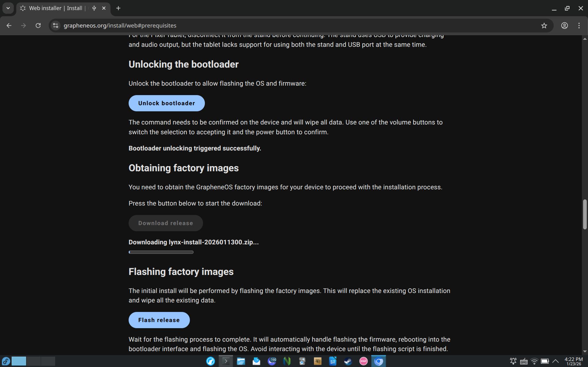
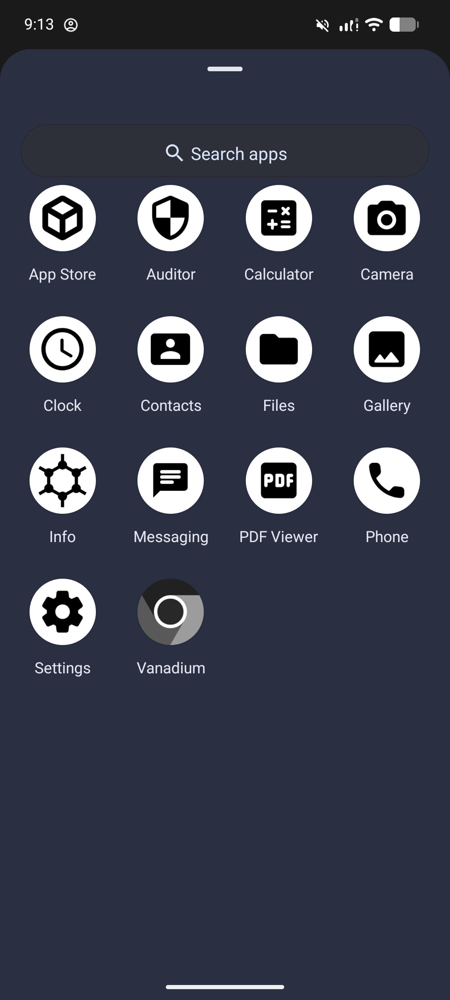
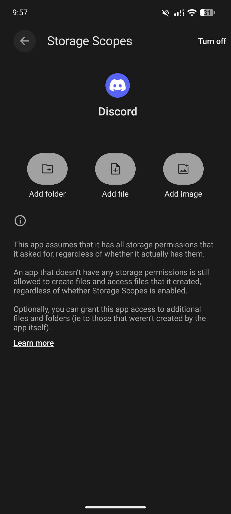
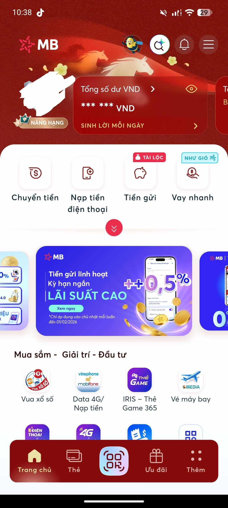
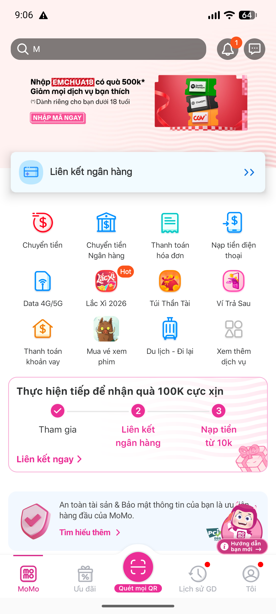
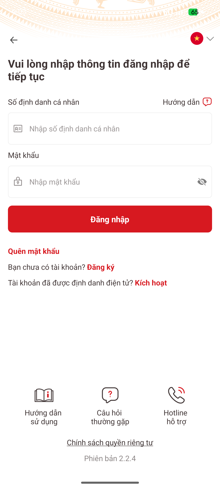
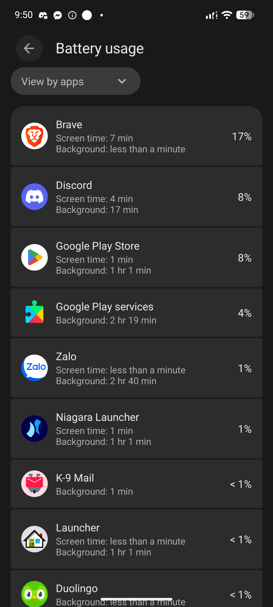
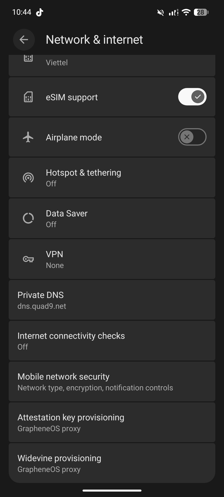
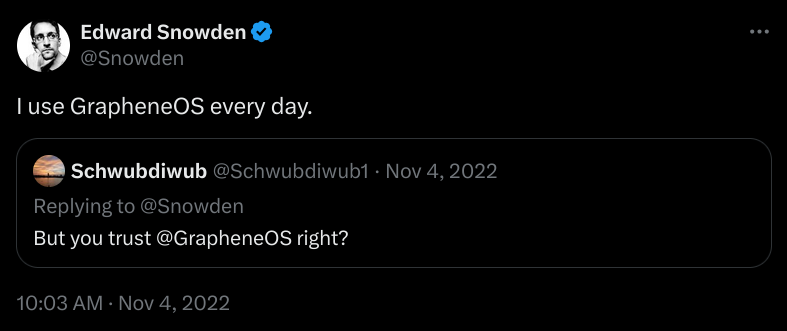

This post is my experience with GrapheneOS, a private and secure OS for mobile phones (especially Google Pixel phones).

# Hardware
GrapheneOS can **only be installed on Pixel phones** because of the project’s strict requirements. So I could not install it on my iPhone, nor on random Android devices.

To use GrapheneOS, I sold my iPhone and bought a Pixel 7a from a stranger. Fortunately, the device was an unlocked model, which allowed me to unlock the bootloader and install GrapheneOS without any issues.

The Pixel 7a itself is a solid phone. It has a 6.1" OLED 90hz HDR-support display, a 4385mAh battery with 18W fast charging, 8GB LPDDR5 RAM, 128GB UFS storage. Its size is well balanced, not too large and not too small, making it comfortable to use without feeling narrow or cramped.

# Installation
Installing GrapheneOS is relatively straightforward. You don't need to install `adb` or `fastboot`, or type long commands to install it. You only need a supported web browser (most Chromium-based browsers are supported, while Firefox and Gecko-based are not), then put the phone into fastboot mode, connect it to a computer, and follow the on-screen instructions to complete the installation on the [GrapheneOS WebUSB Installer](https://grapheneos.org/install/web)

The whole process takes around 10 minutes from start to finish.

# First-boot
The first-boot process on GrapheneOS is similar to stock Android: language selection, time settings, and lock screen setup. The main difference is that **there is no Google sign-in step and no preinstalled bloatware**.

Because of this, I can skip the diagnostics options and app suggestions and reach the home screen quickly, without having to manually uncheck each item like on stock Android.

After reaching the home screen, GrapheneOS comes with **only 14 preinstalled apps**. Most of these are essential system applications such as Phone, Messages, Camera, and Settings. There are no social apps, no vendor apps, and no unnecessary extras. You can also disable some of the default apps if you do not need them, reducing the app list even further.

# Features
From a practical perspective, GrapheneOS mainly improves Android in three areas: permission control, service isolation, and system hardening.

GrapheneOS provides much stronger **permission management** than stock Android. It allows per-app control over **network access**, **sensors** (camera, microphone, GPS), and **storage scopes**, so an app can be limited to specific folders instead of the entire storage. In daily use, this makes it easier to restrict unnecessary access without breaking most apps.

| Permission control          | Storage Scopes              |
| --------------------------- | --------------------------- |
|  |  |

**Sandboxed Google Play** is another important feature. I can install Google Play services for compatibility, but they run like normal apps instead of having system-level privileges. This means apps that depend on Google services usually work, but Google itself does not get deep access to the system like on stock Android.

GrapheneOS also supports **multiple user profiles** with strong isolation between them. You can also add a guest account and use it as a burner profile for temporary or less trusted apps. However, in my usage, I do not rely on multi-profile separation. Instead, I mainly use **Private Space** (Android 15+) to isolate a small number of apps that I do not want mixed with the rest of the system.

For location privacy, GrapheneOS can **reroute location requests** through its own location service, preventing apps from directly accessing Google’s location APIs. In practice, this works transparently and does not noticeably affect location accuracy.

In addition, the system includes several **hardening and exploit protection features**, such as:
- Automatically disabling Wi-Fi and Bluetooth when not in use
- Automatic reboot after a configurable period of inactivity
- USB-C port control to limit data access when the device is locked

These features operate mostly in the background and do not change the visual experience, but they add extra layers of protection against both tracking and exploitation.

# Daily drive
## My experience
The user experience of GrapheneOS is quite simple, without many customization features or fancy stuff. The operating system is fairly stable, has few bugs, and is updated continuously.

Compared to other custom interfaces (OneUI, HyperOS, …), GrapheneOS is more stable, feels smoother, and has no bloatware. Everything is focused on security and minimalism rather than entertainment features. It has very limited customization options, so it is clearly not designed for users who want heavy customization or a feature-rich interface.

The system apps work well, but their interface feels dated, similar to Android 5. The Calendar app is not preinstalled, but you can install **Etar** from Play Store. The Vanadium browser is quite minimal and lacks many advanced features, it can be replaced with browsers like Cromite or Brave (with most extra features disabled).

Most of the time, Sandboxed Google Play works well and push notifications are rarely delayed. However, Location sometimes does not work (this may be my fault because I use the reroute location feature).

## Banking and Government apps
I use MBBank and Vietcombank, two popular banks in Vietnam, as well as the MoMo e-wallet. They all work well and have no issues (especially after installing Play Services), even though they are frequently updated to block root and custom ROMs.

| | |
| --- | --- |
|  |  |

In addition, there is the VNeID app, which is famous for being difficult to bypass root checking. It also works without any problems.

However, only Google Wallet does not work (because it does not pass Play Integrity, and Google does not like custom ROMs). That said, I do not really need Google Wallet, especially since in Vietnam and Japan, QR code payments are far more common, and I also prefer using physical cards anyway.

## Battery
Battery life is quite bad. Apps are allowed to run in the background excessively (especially Play Services and Meta apps like Facebook or Instagram, even when background activity is restricted). I will try to fix this soon.

# My settings
| | | |
|---|---|---|
|  |  |  |

# Conclusion
So far, I have been quite satisfied with GrapheneOS. It is exactly what I was looking for, and it feels better than anything I have used on a smartphone before.

I use my phone mainly as a tool rather than an entertainment or social media device, and in that role, GrapheneOS fits very well. It provides a clean system, strong control over permissions, and a focus on reliability instead of flashy features. Everything I need works, and most unnecessary distractions are removed by default.

GrapheneOS is clearly not designed for users who want heavy customization or a feature-rich interface. Instead, it is built for people who value security, privacy, and control over their device. In practice, this means accepting some trade-offs, such as limited support for certain Google-certified features, and occasionally having to adjust usage habits.

For me, this trade-off is reasonable. Using GrapheneOS has made me more intentional about how I use my phone and which apps I allow to run on it. Treating the phone as a practical tool rather than a constant source of notifications and entertainment has been a positive change.

Overall, if you are looking for a smartphone operating system that prioritizes security and privacy, and if you are willing to give up some convenience and visual polish, GrapheneOS is worth trying. For my personal use case, it has been a good choice and I do not regret switching to it.

