# Frequency Response
Frequency response is the squiggly line that you can see below. It describes the sound pressure level produced by headphones or IEMs at different frequencies within the human audible range.
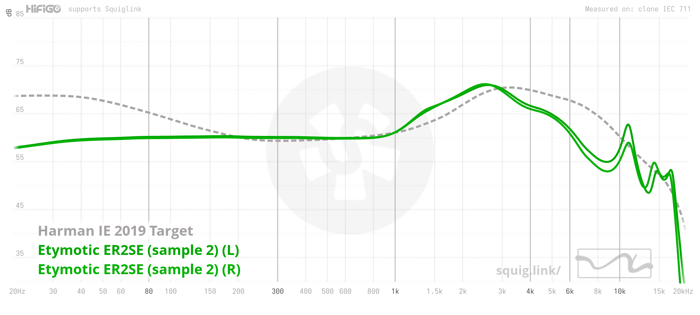

With frequency response, you can basically "see" what a headphone sounds like. Does it have bass? Is the sound more forward or more recessed? Is it bright or dark? All of these characteristics can be reflected in the frequency response.

# Target Curves, Diffuse Field
In order to understand what a headphone sounds like, we need a baseline, and that baseline is the target curve.

A target curve is a reference response used to compare how the frequency response of a headphone looks. It can also be based on research into what is considered neutral (such as IEF Neutral or Diffuse Field), or what sound is preferred by the largest number of listeners (such as Harman).
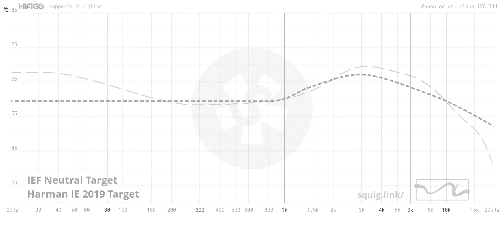

Diffuse Field is the response of a flat speaker in a perfectly reflective environment, where sound reaches the listener from all directions. The Diffuse Field target has also long been considered a representation of a flat or neutral sound.
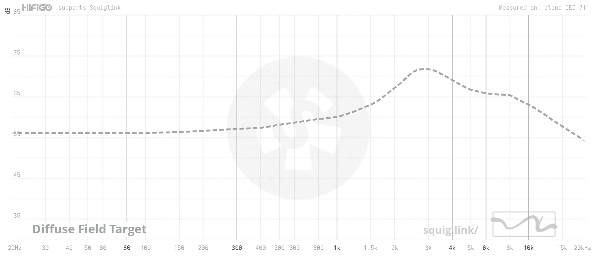

# 5128 and the problems with the legacy 711
IEC 60318-4 (also known as IEC-711) is the most widely used measurement standard/coupler for headphones and IEMs. However, it has several limitations, including not fully representing the acoustics of the human ear and becoming less accurate at higher frequencies.

This is one of the reasons why the B&K 5128 was developed. The 5128 uses a more realistic ear simulator and provides a more accurate representation of the acoustics of the human ear, especially at higher frequencies, allowing measurements across the full audible range of roughly 20–20,000 Hz.

Because of this, the 5128 Diffuse Field response does not have the same extremely bright and sharp treble seen in the traditional 711 Diffuse Field response, resulting in a response that I find closer to a natural perception of flat sound.
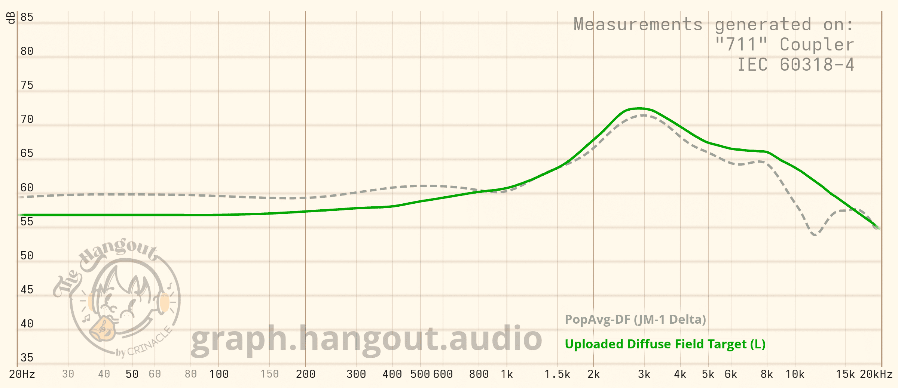

# How I found my ideal sound
First, I use JM-1 as my baseline. JM-1 is an adjusted version of Diffuse Field designed to produce a response that better represents how a real human ear perceives sound.
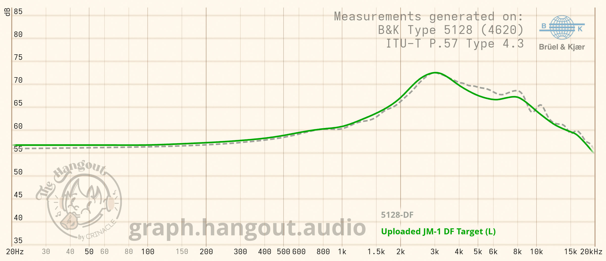

Next, I apply a downward tilt to make the sound warmer and more natural. Diffuse Field represents a flat response in a highly reflective environment, while a downward tilt is more appropriate for a response intended to sound natural in more typical listening environments.
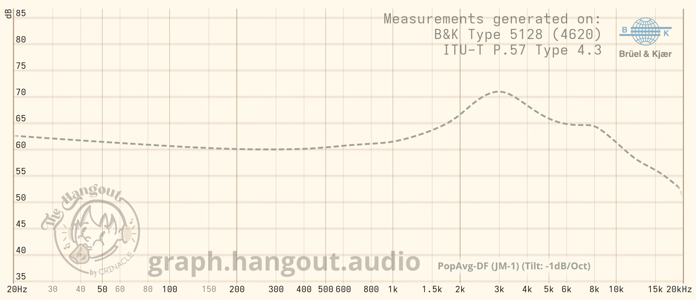

After a lot of testing and listening, I also found that the ear gain around 3 kHz still sounded slightly shouty to me. So I reduced 3 kHz by 1 dB to reduce that shoutiness.
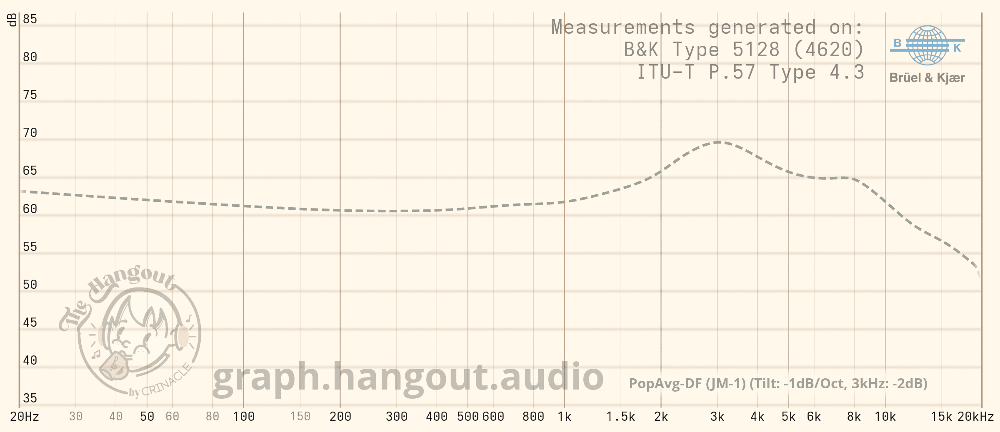

And that's how I arrived at my own target curve.
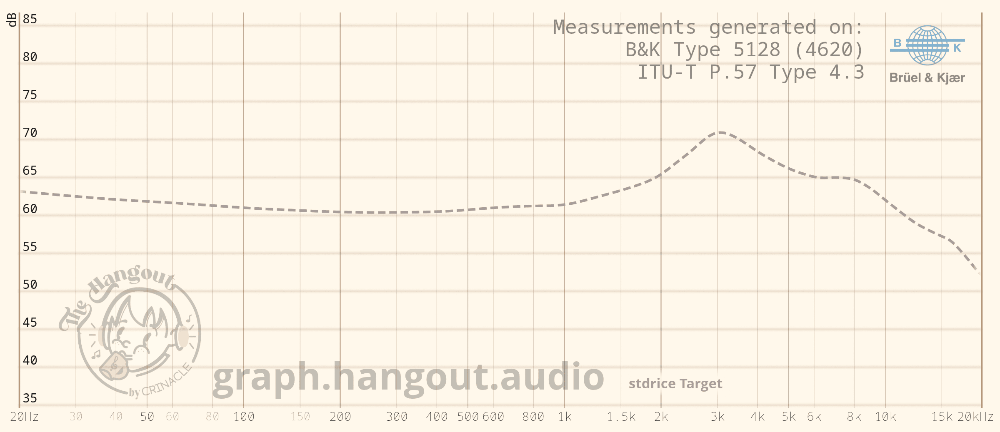

# Porting to 711
IEC 60318-4 is still the most widely used measurement system in the headphone hobby and audio industry. So even though it has several limitations, it is still useful as a reference.

After doing the necessary calculations, I was able to create the following target for 711
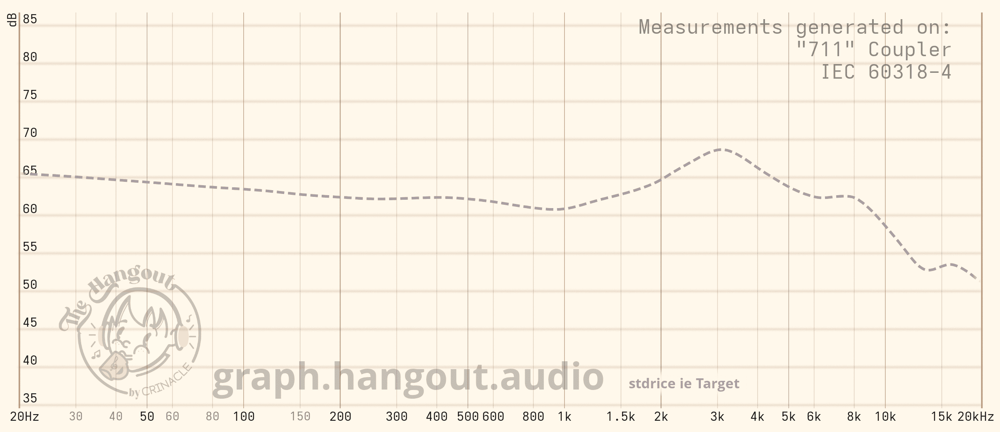

# How I use it and my personal preference
I consider this as my neutral target, so I mainly use it to compare the tonality of headphones rather than to determine whether a headphone matches my personal preference. Bass is optional.

For example, the graph above shows the Moondrop x Crinacle Silicon compared to my target. It has a slight bass boost, while the mids and treble are quite close to my target. Overall, it has a neutral sound with a slight sub-bass boost.
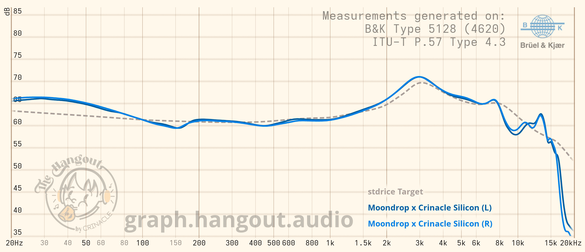

Personally, I like an 80 Hz Q 0.71 low-shelf bass boost because it creates a subwoofer-like effect. And somehow, when translated to the 711 measurement system, this corresponds to a 105 Hz Q 0.71 low-shelf.
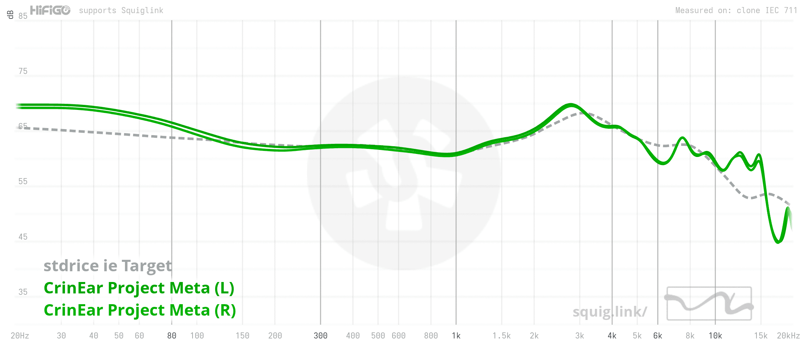

# Some headphones that matches my target and my comments
## Moondrop x Crinacle Silicon
It matches my target almost perfectly throughout the midrange and treble, while having a slight bass shelf that extends up to around 150 Hz. This matches my personal preference almost perfectly.

Although I haven't had the chance to listen to it yet, I have a feeling it would be one of my favorite IEMs.

## Truthear Pure
It also matches my target quite closely. Its bass isn't overly boosted, but the elevation extends into the lower midrange, giving it a warm overall presentation. Its treble is also relatively relaxed.
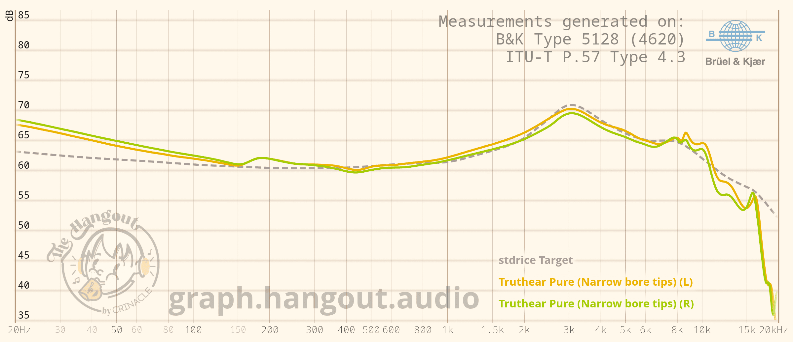

Overall, it has a very natural midrange and a non-aggressive presentation, making it a great IEM for long listening sessions.

## Crinear Daybreak
To me, the Daybreak has a slight V-shaped character. It has elevated bass and treble, giving it a fun and versatile sound.
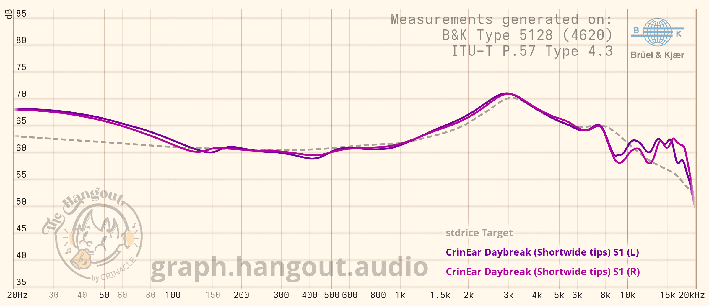

# Conclusion
You can find my target curves here: [github/stdrice/audio](https://github.com/stdrice/audio)
