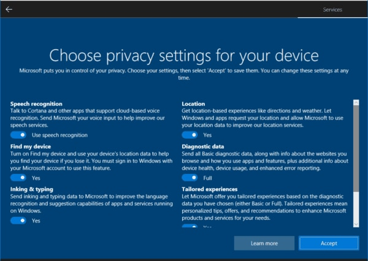

# Choosing Windows edition
There are 2 editions I want to mention:
| Edition | Pros | Cons |
|---------|------|------|
| **Consumer (Home, Pro, …)** | Widely supported, latest features | Comes with ads, telemetry, shorter support lifecycle |
| **LTSC / IoT LTSC** | Minimal bloat, no forced feature updates, support up to 10 years | Latest version is only 21H2 (some apps now require 22H2) |

- If your software runs fine on old builds, go with **IoT LTSC**. Otherwise, stick with Consumer and debloat it manually.  

Btw, you can get these Windows editions here: [massgrave.dev](https://massgrave.dev/genuine-installation-media)

# OOBE setup
1. **Do not connect to the Internet yet.**  
   - If there’s no *“I don’t have Internet”* option, press `Shift + F10` and run:  
     ```
     oobe\bypassnro
     ```
     Windows will reboot and show the offline setup option.

2. **Skip Microsoft account login** if you want a clean local user, and don't want to fuck up your user folder.
3. On privacy settings screen, **disable all options**.


# Post-installation tweaks
## Remove unnecessary apps
- Go to **Apps -> Installed apps**: uninstall apps that you don’t need
- Open **Powershell (Admin)** and type these commands to remove UWP apps quickly
```
# Your Phone / Phone Link
Get-AppxPackage *Microsoft.YourPhone* | Remove-AppxPackage

# Get Help
Get-AppxPackage *Microsoft.GetHelp* | Remove-AppxPackage

# Tips
Get-AppxPackage *Microsoft.Tips* | Remove-AppxPackage

# Groove Music
Get-AppxPackage *ZuneMusic* | Remove-AppxPackage

# News / Weather / Finance / Sports
Get-AppxPackage *Microsoft.BingNews* | Remove-AppxPackage
Get-AppxPackage *Microsoft.BingWeather* | Remove-AppxPackage
Get-AppxPackage *Microsoft.BingSports* | Remove-AppxPackage
Get-AppxPackage *Microsoft.BingFinance* | Remove-AppxPackage

# Xbox
Get-AppxPackage *XboxApp* | Remove-AppxPackage
Get-AppxPackage *Xbox.TCUI* | Remove-AppxPackage
Get-AppxPackage *XboxIdentityProvider* | Remove-AppxPackage
Get-AppxPackage *XboxGamingOverlay* | Remove-AppxPackage

# Skype / Teams
Get-AppxPackage *SkypeApp* | Remove-AppxPackage
Get-AppxPackage *MicrosoftTeams* | Remove-AppxPackage

# Remove for all existing + future users (provisioned packages)
Get-AppxProvisionedPackage -Online |
Where-Object DisplayName -match "Xbox|YourPhone|Skype|ZuneMusic|GetHelp|Tips|BingNews|BingWeather|BingSports|BingFinance" |
Remove-AppxProvisionedPackage -Online
```

### Remove Microsoft Edge
Open **Powershell (Admin)** and type these commands
```
$paths = @("C:\Program Files (x86)\Microsoft\Edge\Application","C:\Program Files\Microsoft\Edge\Application"); foreach ($p in $paths) { if (Test-Path $p) { $edge = Get-ChildItem $p -Directory | Sort-Object Name -Descending | Select-Object -First 1; Start-Process "$($edge.FullName)\Installer\setup.exe" "-uninstall -system-level -force-uninstall" -Wait; break } }

reg add "HKLM\SOFTWARE\Microsoft\EdgeUpdate" /v DoNotUpdateToEdgeWithChromium /t REG_DWORD /d 1 /f

schtasks /Change /TN "MicrosoftEdgeUpdateTaskMachineCore" /Disable
schtasks /Change /TN "MicrosoftEdgeUpdateTaskMachineUA" /Disable
```

## Disable unnecessary services, features and telemetry
Open **Powershell (Admin)** and type these commands
```
Stop-Service "SysMain" -Force
Set-Service "SysMain" -StartupType Disabled
Stop-Service "DiagTrack" -Force
Set-Service "DiagTrack" -StartupType Disabled
Stop-Service "WSearch" -Force
Set-Service "WSearch" -StartupType Disabled
Set-Service "BthAvctpSvc" -StartupType Manual
Stop-Service "TrkWks" -Force
Set-Service "TrkWks" -StartupType Disabled
Stop-Service "MapsBroker" -Force
Set-Service "MapsBroker" -StartupType Disabled
Set-Service "Fax" -StartupType Manual
Stop-Service "fhsvc" -Force
Set-Service "fhsvc" -StartupType Disabled
Set-Service "LanmanServer" -StartupType Manual
Stop-Service "wisvc" -Force
Set-Service "wisvc" -StartupType Disabled
Stop-Service "workfolderssvc" -Force
Set-Service "workfolderssvc" -StartupType Disabled
Stop-Service "XboxGipSvc" -Force
Set-Service "XboxGipSvc" -StartupType Disabled
Stop-Service "XblAuthManager" -Force
Set-Service "XblAuthManager" -StartupType Disabled
Stop-Service "XblGameSave" -Force
Set-Service "XblGameSave" -StartupType Disabled
Stop-Service "XboxNetApiSvc" -Force
Set-Service "XboxNetApiSvc" -StartupType Disabled
Stop-Service WerSvc -Force
Set-Service WerSvc -StartupType Disabled
Stop-Service lfsvc -Force
Set-Service lfsvc -StartupType Disabled
Stop-Service RetailDemo -Force
Set-Service RetailDemo -StartupType Disabled
Stop-Service dmwappushservice -Force
Set-Service dmwappushservice -StartupType Disabled

reg add "HKLM\SOFTWARE\Policies\Microsoft\Windows\DataCollection" /v AllowTelemetry /t REG_DWORD /d 0 /f
reg add "HKLM\SOFTWARE\Policies\Microsoft\Windows\CloudContent" /v DisableWindowsConsumerFeatures /t REG_DWORD /d 1 /f
reg add "HKLM\SOFTWARE\Policies\Microsoft\Windows\CloudContent" /v DisableTailoredExperiencesWithDiagnosticData /t REG_DWORD /d 1 /f
reg add "HKLM\SOFTWARE\Microsoft\Windows\CurrentVersion\DeliveryOptimization\Config" /v DODownloadMode /t REG_DWORD /d 0 /f
reg add "HKCU\Software\Microsoft\Siuf\Rules" /v NumberOfSIUFInPeriod /t REG_DWORD /d 0 /f
reg add "HKCU\Software\Microsoft\Siuf\Rules" /v PeriodInNanoSeconds /t REG_QWORD /d 0 /f
reg add "HKCU\Software\Microsoft\Windows\CurrentVersion\AdvertisingInfo" /v Enabled /t REG_DWORD /d 0 /f
reg add "HKCU\Software\Microsoft\Windows\CurrentVersion\Privacy" /v TailoredExperiencesWithDiagnosticDataEnabled /t REG_DWORD /d 0 /f
reg add "HKCU\Software\Microsoft\Windows\CurrentVersion\BackgroundAccessApplications" /v GlobalUserDisabled /t REG_DWORD /d 1 /f
reg add "HKCU\Software\Policies\Microsoft\Windows\Explorer" /v DisableSearchBoxSuggestions /t REG_DWORD /d 1 /f
reg add "HKLM\SOFTWARE\Policies\Microsoft\Windows\Windows Error Reporting" /v Disabled /t REG_DWORD /d 1 /f
reg add "HKLM\SOFTWARE\Policies\Microsoft\Windows\Windows Search" /v DisableWebSearch /t REG_DWORD /d 1 /f
reg add "HKCU\Software\Microsoft\Windows\CurrentVersion\ContentDeliveryManager" /v RotatingLockScreenEnabled /t REG_DWORD /d 0 /f
reg add "HKCU\Software\Microsoft\Windows\CurrentVersion\ContentDeliveryManager" /v RotatingLockScreenOverlayEnabled /t REG_DWORD /d 0 /f

schtasks /Change /TN "\Microsoft\Windows\Application Experience\Microsoft Compatibility Appraiser" /Disable
schtasks /Change /TN "\Microsoft\Windows\Application Experience\ProgramDataUpdater" /Disable
schtasks /Change /TN "\Microsoft\Windows\Customer Experience Improvement Program\Consolidator" /Disable
schtasks /Change /TN "\Microsoft\Windows\Customer Experience Improvement Program\UsbCeip" /Disable
schtasks /Change /TN "\Microsoft\Windows\DiskDiagnostic\Microsoft-Windows-DiskDiagnosticDataCollector" /Disable

Disable-WindowsOptionalFeature -Online -FeatureName Internet-Explorer-Optional-amd64 -NoRestart
Disable-WindowsOptionalFeature -Online -FeatureName WorkFolders-Client -NoRestart
Disable-WindowsOptionalFeature -Online -FeatureName Printing-XPSServices-Features -NoRestart
```

## Disable indexing for C:\
- Open **File Explorer**
- Right click on `C:\` -> Properties
- Untick **Allow files on this drive to have contents indexed in addition to file properties**
- Choose **Apply changes to drive C:\ , subfolders and files**
- Choose **Ignore all** if there are any errors

## Disable visual effects
Open **Powershell (Admin)** and type these commands
```
reg add "HKCU\Software\Microsoft\Windows\CurrentVersion\Explorer\VisualEffects" /v VisualFXSetting /t REG_DWORD /d 3 /f
reg add "HKCU\Software\Microsoft\Windows\CurrentVersion\Explorer\Advanced" /v IconsOnly /t REG_DWORD /d 0 /f
reg add "HKCU\Software\Microsoft\Windows\CurrentVersion\Explorer\Advanced" /v ListviewShadow /t REG_DWORD /d 1 /f
reg add "HKCU\Control Panel\Desktop" /v DragFullWindows /t REG_SZ /d 0 /f
reg add "HKCU\Control Panel\Desktop" /v FontSmoothing /t REG_SZ /d 2 /f
reg add "HKCU\Control Panel\Desktop" /v FontSmoothingType /t REG_DWORD /d 2 /f
reg add "HKCU\Control Panel\Desktop\WindowMetrics" /v MinAnimate /t REG_SZ /d 0 /f
reg add "HKCU\Control Panel\Desktop" /v UserPreferencesMask /t REG_BINARY /d 9012038010000000 /f
reg add "HKCU\Software\Microsoft\Windows\CurrentVersion\Themes\Personalize" /v EnableTransparency /t REG_DWORD /d 0 /f
reg add "HKCU\Software\Microsoft\Windows\CurrentVersion\Explorer\Advanced" /v TaskbarBadges /t REG_DWORD /d 0 /f
```

## Disable startup delay
Open **Powershell (Admin)** and type these commands
```
reg add "HKCU\Software\Microsoft\Windows\CurrentVersion\Explorer\Serialize" /v StartupDelayInMSec /t REG_DWORD /d 0 /f
```

# Recommended software alternatives
After cleaning Windows, you’ll probably want to replace Microsoft’s built-in apps with lighter and better alternatives:

| Category         | Built-in app               | Alternative                                                                                                                                |
| ---------------- | -------------------------- | ------------------------------------------------------------------------------------------------------------------------------------------ |
| **Browser**      | Microsoft Edge             | [Helium](https://helium.computer), [Brave](https://brave.com)                                                                              |
| **Office**       | Microsoft 365 (trial nags) | [LibreOffice](https://libreoffice.org)                                                                                                     |
| **Media player** | Movies & TV / Groove Music | [VLC](https://videolan.org), [MPV](https://mpv.io), [MPC-HC](https://codecguide.com/download_kl.htm), [Foobar2000](https://foobar2000.org) |
| **Photos**       | Photos app (slow, ads)     | [ImageGlass](https://imageglass.org), [IrfanView](https://irfanview.com), [nomacs](https://nomacs.org)                                     |
| **Notepad**      | Notepad / WordPad          | Classic Notepad, [Notepad++](https://notepad-plus-plus.org)                                                                                |
| **Compression**  | Built-in zip (limited)     | [7-Zip](https://7-zip.org), [PeaZip](https://peazip.github.io), [Nanazip](https://nanazip.org)                                             |
| **App Store**    | Microsoft Store            | [Chocolatey](https://chocolatey.org), Winget (package managers)                                                                            |
