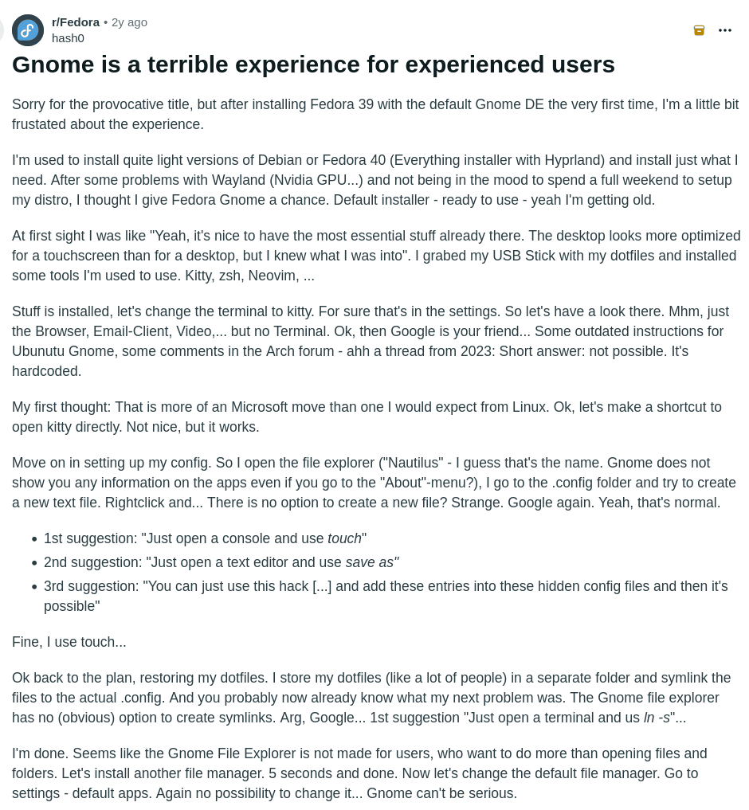
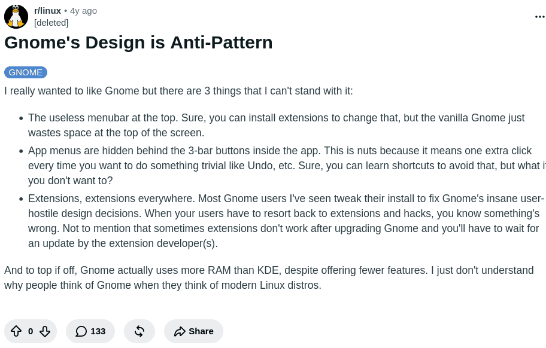
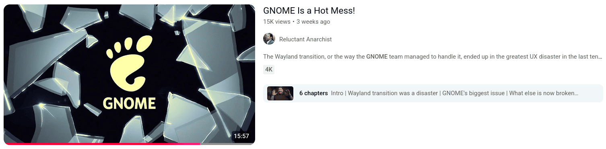
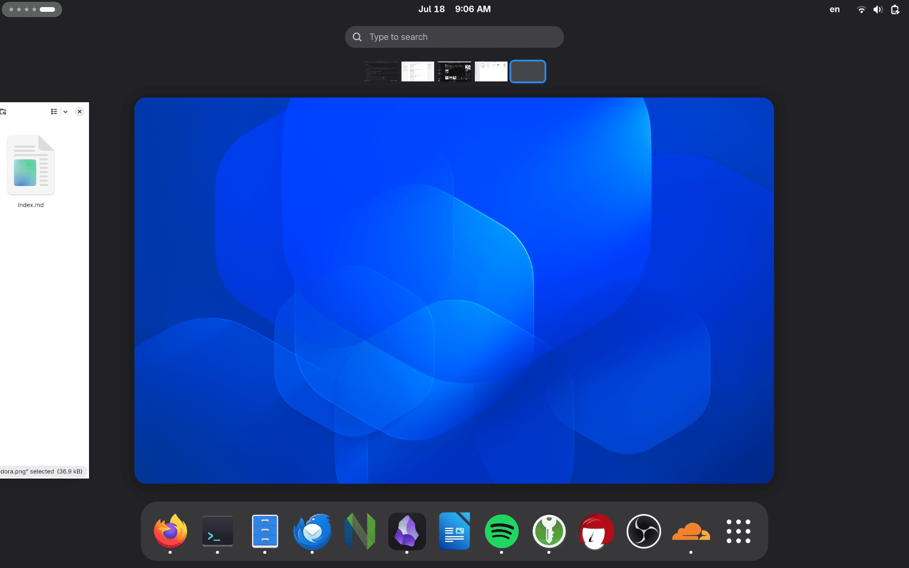
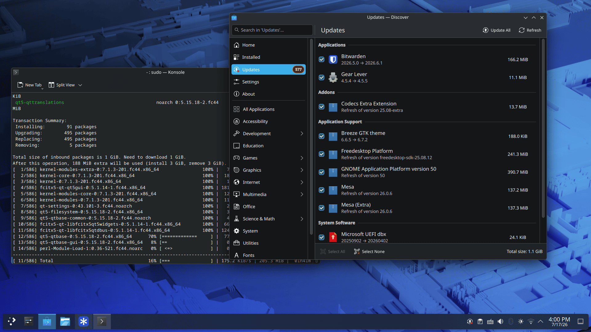
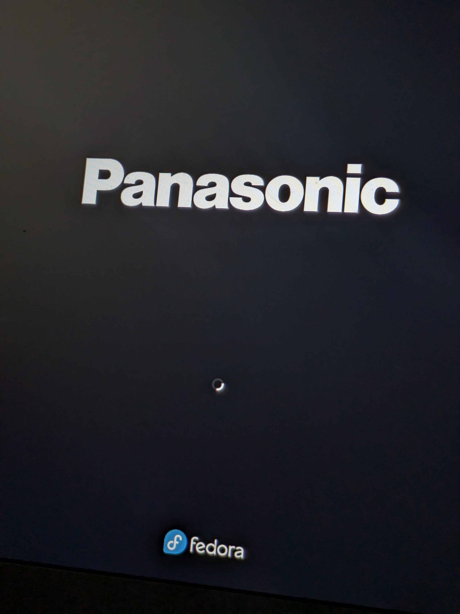
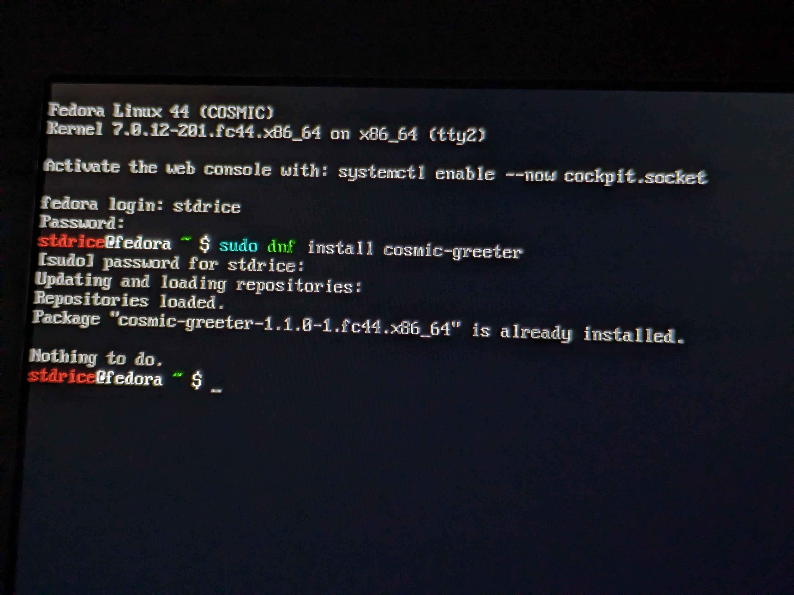
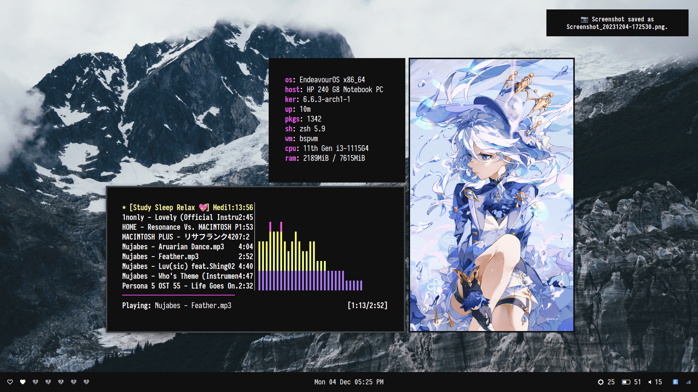

In 2026, many desktop environments and window managers are evolving at an incredible pace, such as KDE Plasma, COSMIC, Hyprland, and more.

At the same time, GNOME is probably the most criticized desktop environment. Everywhere I go, I see people complaining about GNOME.

So why do I still recommend GNOME?

# "Industry Standard"
Like it or not, GNOME has become the reference desktop for Linux. Most major distributions still ship GNOME as their default desktop environment. Even though KDE Plasma has improved tremendously over the years, many flagship distributions, such as Fedora, continue to choose GNOME.

A small but interesting example is Fedora itself. The GNOME edition is simply called **Fedora Workstation**, while the KDE edition is named **Fedora KDE Plasma Desktop**. That naming alone reflects GNOME's position as **Fedora's primary desktop experience**, while KDE is offered as an alternative.

# Design
Personally, I think GNOME has **the best-looking interface of any Linux desktop**.

I don't care whether it has blur effects or transparent panels. What matters to me is that everything feels intentional. The typography, spacing, icons, animations, and applications all follow the same design language.

Then there's KDE Plasma. I know many people love Breeze, but to me it looks like Android 5, if not worse. I don't need blur, transparency, or tons of visual effects. Even if Plasma has all of those, I still don't find it visually appealing.

# Philosophy and workflow
This is probably the most controversial reason.

GNOME deliberately moves away from the traditional desktop workflow. It **removes many traditional desktop elements** such as dock/taskbar, minimize/maximize buttons, desktop icons, system tray, ... Instead, it revolves around the **Overview** and **Workspaces**.

I understand why many people dislike this approach. It feels unfamiliar at first, and it takes time to adapt. But once it clicks, it becomes surprisingly efficient and difficult to leave behind.

Another thing I appreciate most about GNOME is that it **rarely ships features before they're ready**.

Instead of trying to include every possible feature, GNOME focuses on shipping fewer features that are well-designed, well-tested, and properly integrated with the rest of the desktop.

Of course, this philosophy also has its downsides.

GNOME **removes a lot of settings that I think a desktop environment should expose, or at least settings that I personally want to have**. Things like managing startup applications, changing the system font or switching the GTK theme aren't available in the default Settings app, even though I think they should be.

I understand that the GNOME developers want to keep the interface simple, but I do think they've gone a little too far in a few areas.

# Performance and Stability
People often say GNOME is heavy, but that hasn't been my experience.

Memory usage between GNOME and KDE Plasma is **fairly similar** today (Fedora 44). On my hardware (i5-7300U), however, GNOME consistently **uses less CPU and GPU resources**. Its interface is relatively simple, without blur or visual effects, and the desktop itself consists of fewer independent components. GNOME's core applications also **launch noticeably faster on my machine than their KDE counterparts**.

I've been using GNOME since [Bionic Beaver 18.04](https://releases.ubuntu.com/18.04), and during all those years I've encountered very few serious bugs, usually only after modifying the system myself.

My experience with KDE Plasma has been quite different. I frequently ran into bugs or even desktop crashes. I also tried COSMIC, and while it was generally excellent, one system update broke `cosmic-greeter`, preventing me from logging in normally.
| |
| :- | :- |
|  |  |

# Why not window manager?
I've spent a long time using different window managers over the years, so this isn't coming from someone who's never tried them. I understand why people love them, and I understand the appeal of building a desktop that's perfectly tailored to your own workflow. But these days, I'm simply too lazy to maintain that kind of setup.

A custom window manager **takes a lot of time**. You have to choose the compositor, notification daemon, launcher, lock screen, clipboard manager, screenshot tools, and countless other components. Then you have to configure everything, make it all work together, and occasionally fix things when updates break your setup.

I don't want to spend days building and maintaining my desktop anymore. I just want something polished that works well out of the box, so I can spend my time doing the things I actually care about.

# But...
Of course, GNOME isn't perfect.

There are still a few things that annoy me, but most of them are things I'd consider nitpicks. For example, you still can't disable touchpad acceleration, adjusting touchpad scrolling speed, disable scaling for XWayland applications, or allow screen tearing (at the time of writing).

Do I wish these features existed? Absolutely.

But at the end of the day, I care far more about the overall experience than a handful of missing options. I'd rather use a desktop that's stable, polished, and consistent than one that gives me every feature I could ask for but feels less reliable as a whole.
