# Why I chose Wayland?
- **Simple**: Wayland is only a protocol, not a large server implementation, so there are fewer background processes and dependencies compared to X11.
- **Efficient**: Everything is handled directly by the compositor, which leads to noticeably better performance and lower overhead than X11’s multi-layered architecture.
- **Security**: Applications are better isolated from each other, especially for input and screen access, making keylogging and screen scraping much harder.
- **Fractional scaling**: Wayland supports fractional scaling natively, so HiDPI displays look sharp without blurry scaling or heavy workarounds.

# Basics
## Distro
I use [Arch Linux](https://archlinux.org) as my main distro mainly because it allows me to start from a minimal base system and build everything up manually. This gives me full control over what runs on my machine and avoids the overhead of a preconfigured desktop environment or unnecessary background services.

## Desktop
I use [Sway](https://swaywm.org) for my desktop. Sway is a Wayland compositor, built around the tiling window manager philosophy. Windows are arranged in tiles, and interaction is driven primarily by keyboard shortcuts and workspaces. Sway is the i3 of the Wayland world, so the workflow will feel familiar if you have used i3 before.

## Audio
I use [PipeWire](https://pipewire.org/) because it is stable in daily use, compatible with other audio server (Pulse, Alsa, ...), low latency (which is good for gaming and making music), easy to configure, support high sample rates.

## Login manager
I don't use any display manager (like GDM, SDDM, ...). Instead I log in directly from a TTY, and my desktop is started automatically when the session is on `tty1`.\
[Read this](https://wiki.archlinux.org/title/GNOME/Keyring#Using_the_keyring) to add PAM for GNOME keyring to tty.

# Package Management
For package management, I use `pacman` with [yay](https://github.com/Jguer/yay) for core system packages, [Flatpak](https://flatpak.org) for user applications.\
This separation keeps the base system clean and tightly integrated with the distribution, while desktop applications are sandboxed and isolated from system dependencies. It also makes updates safer and reduces the risk of breaking the system when installing or removing applications.

# Desktop components
## Status Bar
Instead of `swaybar`, the standard status bar which comes with Sway, I use [Waybar](https://github.com/Alexays/Waybar). Waybar is highly customizable and flexible, which makes it easy to tailor the bar to my needs. I chose it because other options are either too complex to configure or not available in the official repositories.

## Launcher/Menu
[Rofi](https://github.com/davatorium/rofi) is an application launcher and menu originally designed for X11, and it now supports Wayland as well. I chose it mainly because I already had an existing Rofi configuration, so I could reuse it without changing my workflow.
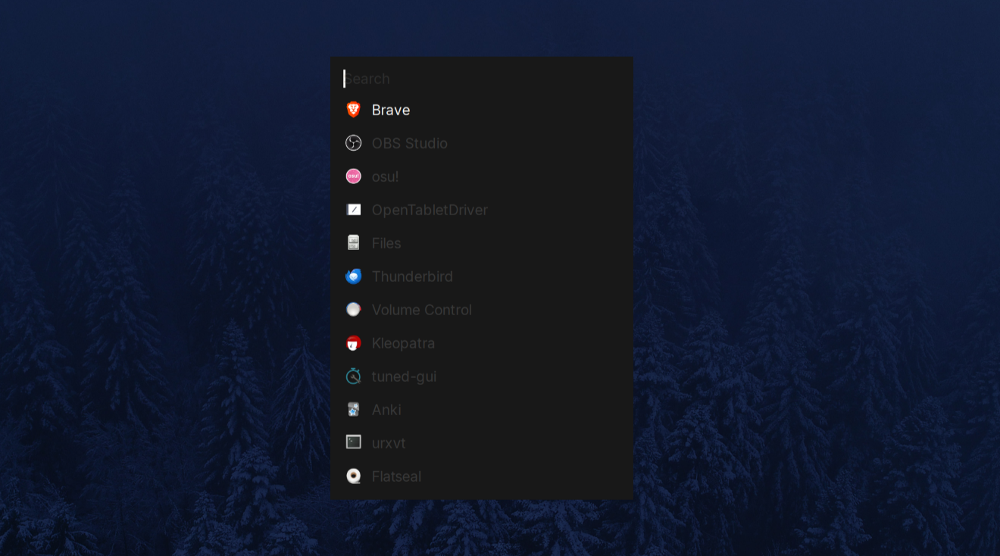

## Notification
Notifications are handled by [Mako](https://github.com/emersion/mako). It is small, unobtrusive, and integrates cleanly with Wayland, providing just enough feedback without turning notifications into visual noise.
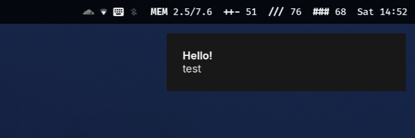

## Lockscreen
I use `swaylock-effects` for lockscreen.
TODO
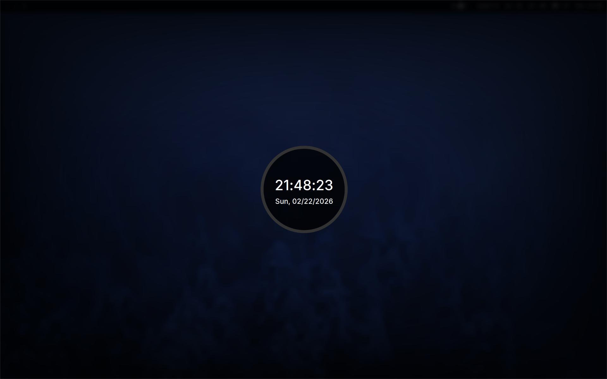

## Screenshot and screen sharing
Screenshots are handled by [grim](https://sr.ht/~emersion/grim) together with [slurp](https://sr.ht/~emersion/slurp), allowing fast region-based captures directly on Wayland.\
For screen sharing to work on Sway/Wayland, `xdg-desktop-portal-wlr` is required.

# Core Software
## Terminal
[foot](https://codeberg.org/dnkl/foot) is my choice of terminal. It is lightweight, fast, and built specifically for Wayland, which makes it a natural fit for a Sway-based setup.

My default shell is `zsh`. I do not use any frameworks like [oh-my-zsh](https://ohmyz.sh); instead, I configured it from scratch.

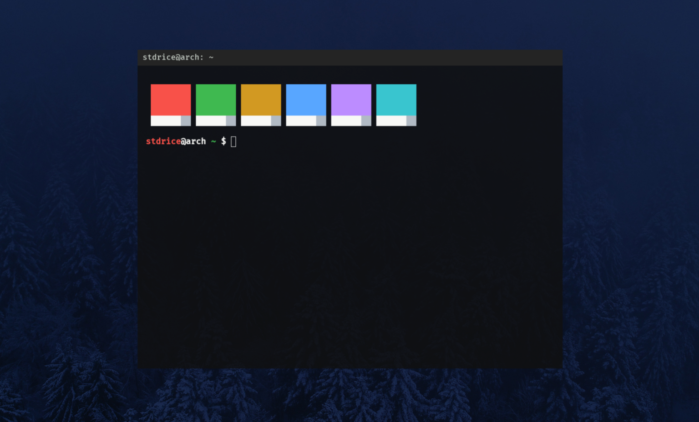

## File manager
For file management, I use [ranger](https://github.com/ranger/ranger) and [Nemo](https://github.com/linuxmint/nemo). Ranger covers most tasks in the terminal with a keyboard-driven workflow, while Nemo is used when a graphical file manager is more convenient.
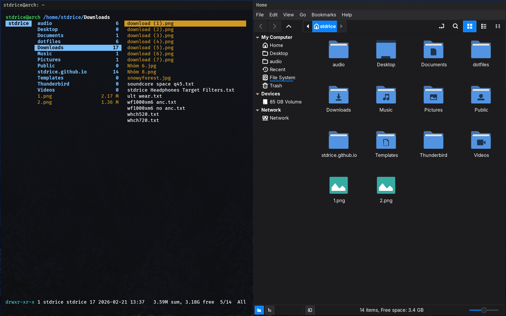

## Text editor
My main editor is [Neovim](https://neovim.io), which I use for editing configuration files, writing, and coding. It integrates well with a terminal-centric workflow and avoids unnecessary distractions.
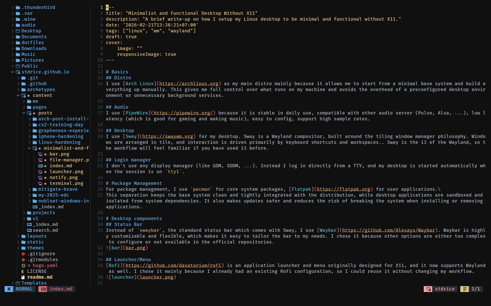

## Terminal workflow
For session management and multitasking inside the terminal, I use [tmux](https://github.com/tmux/tmux). It allows me to split windows, manage multiple sessions, and keep long-running tasks alive.

For Git workflows, I use [lazygit](https://github.com/jesseduffield/lazygit), which provides a clean and efficient interface for common Git operations without leaving the keyboard.
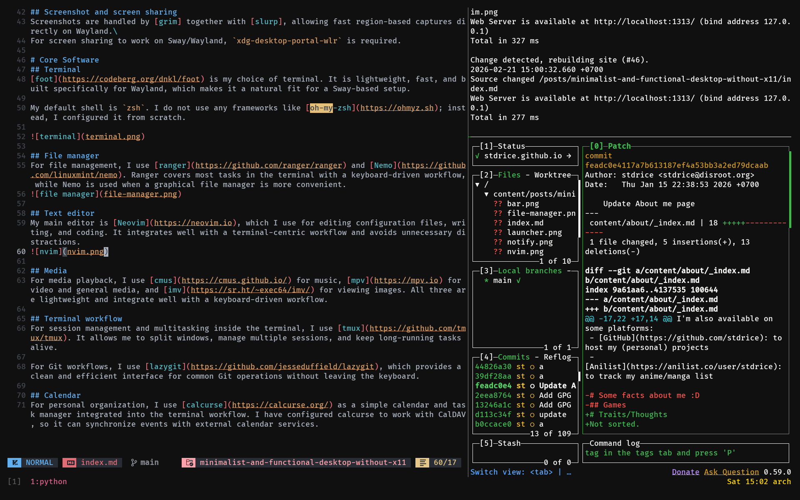

## Media
For media playback, I use [cmus](https://cmus.github.io/) for music, [mpv](https://mpv.io) for video and general media, and [imv](https://sr.ht/~exec64/imv/) for viewing images. All three are lightweight and integrate well with a keyboard-driven workflow.
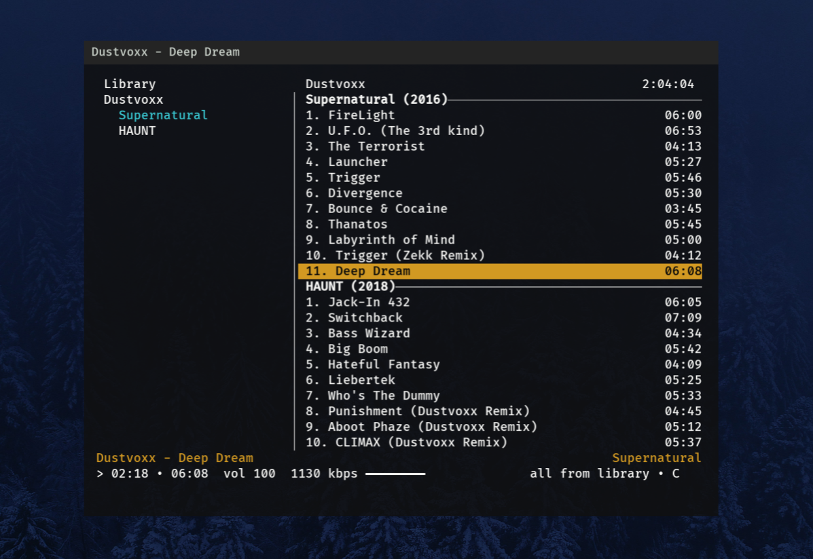
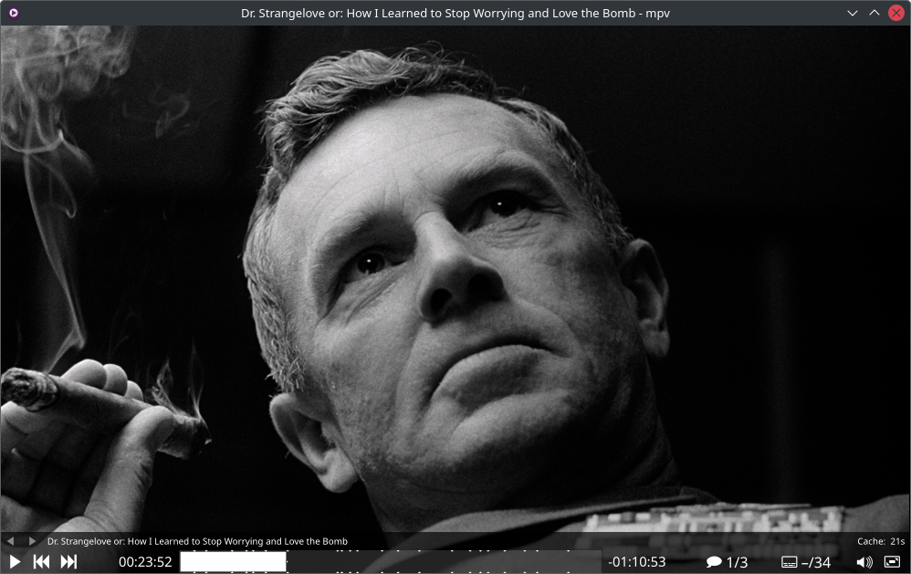

## Calendar
For personal organization, I use [calcurse](https://calcurse.org/) as a simple calendar and task manager integrated into the terminal workflow. I have configured calcurse to work with CalDAV, so it can synchronize events with external calendar services.

## Blue light filter
To reduce eye strain, I use [gammastep](https://gitlab.com/chinstrap/gammastep) for automatic blue light filtering.

## Power
I use [auto-cpufreq](https://github.com/AdnanHodzic/auto-cpufreq) for power management. It is simpler and more efficient than TLP or `power-profiles-daemon`.

# Desktop apps
For daily work and study, I use a small set of desktop applications installed via Flatpak to keep them isolated from the base system.

## Browser
For web browsing, I use [Brave](https://brave.com) because Chromium-based browsers tend to offer better performance and stronger sandboxing compared to Gecko/Firefox.\
I also disable unnecessary built-in features such as Brave Wallet, Brave Ads/Reward, Leo AI, Tor and Safe Browsing.\
Brave Shields is good enough so I don't have to install uBlock Origin.
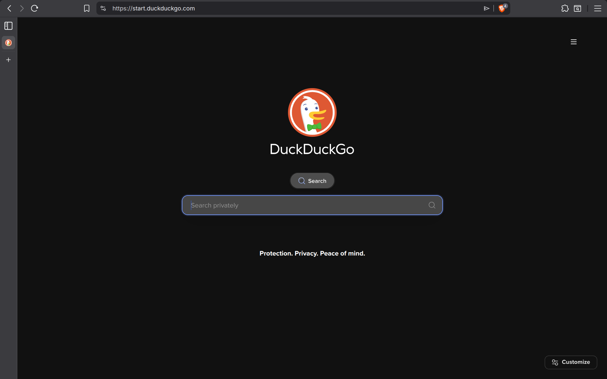

Extensions I use:
- [h264-ify](https://chromewebstore.google.com/detail/h264ify/aleakchihdccplidncghkekgioiakgal)
- [Vimium](https://vimium.github.io)

## Email
Email is handled by [Thunderbird](https://thunderbird.net), which provides a full-featured mail client without relying on a web interface.
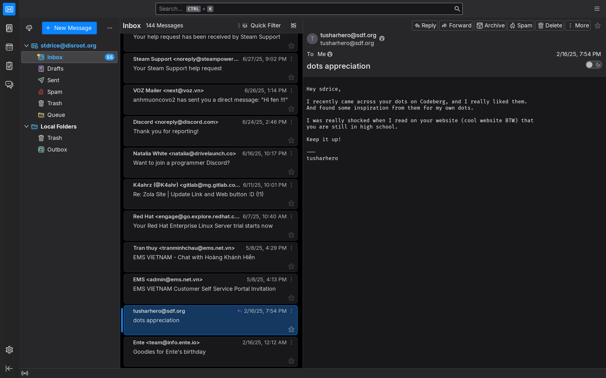

## Note-taking
I use [Obsidian](https://obsidian.md) because it is the only option that is cross-platform, Markdown-based, and powerful for knowledge management.
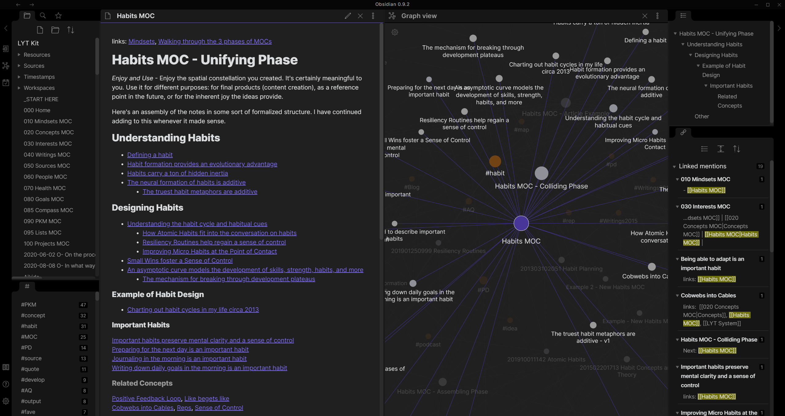

## Recording and streaming
For recording and streaming, I use [OBS Studio](https://obsproject.com), which works reliably with PipeWire and Wayland.
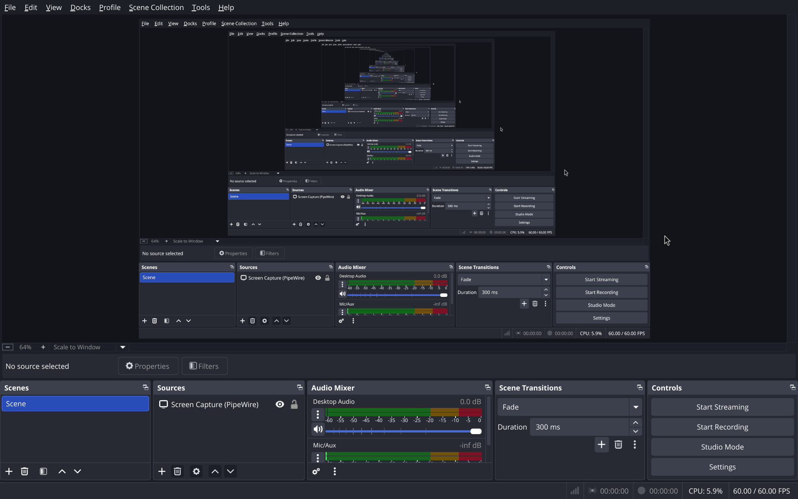

## Other
- [Anki](https://apps.ankiweb.net)
- [Kleopatra](https://apps.kde.org/kleopatra)
- [MusicBrainz Picard](https://picard.musicbrainz.org)
- etc

# Etc.
Everthing else can be found in my [dotfiles repo](https://github.com/stdrice/dotfiles).
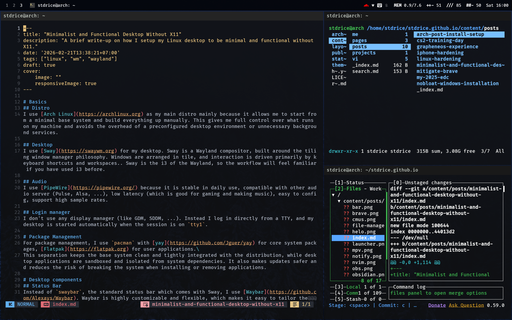
