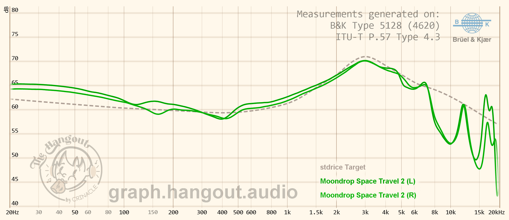
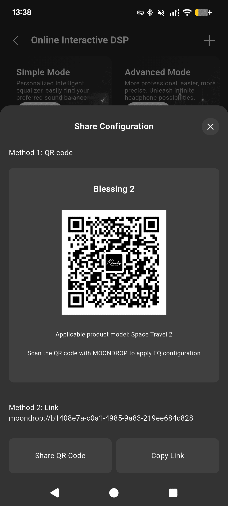
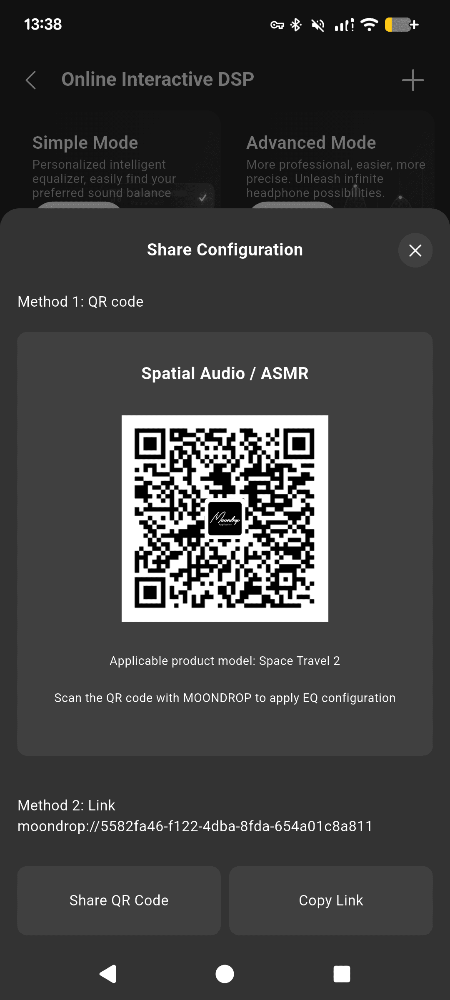
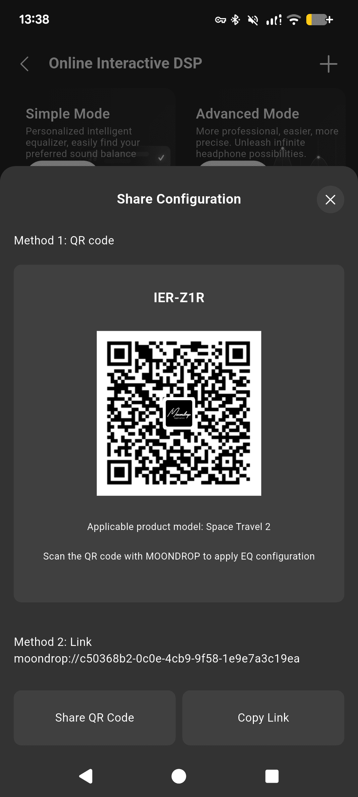
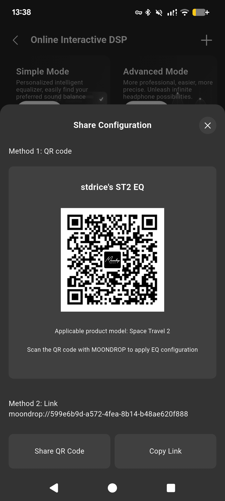
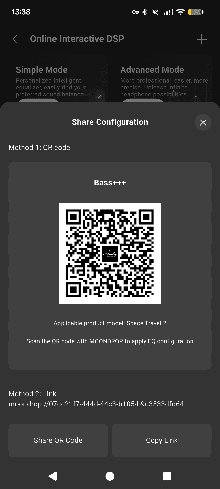
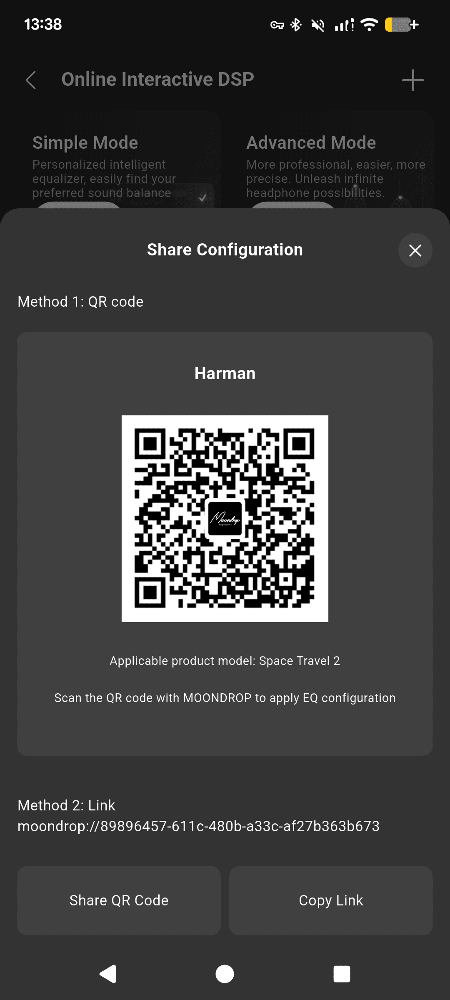

Although I don't want to use wireless headphones/earphones, I still need one for communication. And I don't want something expensive like Apple AirPods or Sony WF-1000X. So I decided to buy the Space Travel 2 to see if it had improved compared to the first generation.

Before that, I used a Space Travel 1, but its battery is really bad, and it has some bugs that I couldn't fix myself.

# Unbox
Same as Space Travel 1, nothing has changed. The box still has a charging cable, eartips and manual.

# Charging case and Housing
It is also the same as the Space Travel 1. The charging case is still prone to scratches like the first generation. The case from the Space Travel 1 is also compatible with the Space Travel 2.

The earbuds have a design similar to the AirPods Pro. However, they are quite large. Since my ears are relatively big, I find them comfortable enough, but for some people, they may cause discomfort after long use.

# Sound
This earphone is tuned to JM-1 tilted aka New Meta. However, I don't like its sound. I find it is really bad at treble, has too much boost around 1-2khz, and its sound is even worse than the Space Travel 1 in some aspects.

But it has EQ, so I can fix the sound and play with different tunings.
| [Blessing 2](moondrop://b1408e7a-c0a1-4985-9a83-219ee684c828) | [Lush](moondrop://8c3d47c3-d7c2-4e6b-9ef3-1fd4467fef3b) |
| --- | --- |
|  |  |
| [Spatial Audio / ASMR](moondrop://5582fa46-f122-4dba-8fda-654a01c8a811) | [IER-Z1R](moondrop://c50368b2-0c0e-4cb9-9f58-1e9e7a3c19ea) |
|  |  |
| [stdrice's ST2 EQ](moondrop://599e6b9d-a572-4fea-8b14-b48ae620f888) | [Bass+++](moondrop://07cc21f7-444d-44c3-b105-b9c3533dfd64) |
|  |  |
| [Harman](moondrop://89896457-611c-480b-a33c-af27b363b673) | |
|  | |

I usually use the Blessing 2 EQ because it is more suitable for daily use than my personal preferred tuning.

# ANC and Transparency
ANC is good, better than Space Travel 1. Transparency is bad, I can't even use this mode outdoors, wind noise reduction is very poor.

# Battery
Much better than Space Travel 1. I can use this earphone 8-11hrs without charging case (compared to 3-4hrs battery life of the Space Travel 1).

# Other
The Space Travel 2 improves many things compared to the Space Travel 1. It now has EQ support, the option to disable voice prompts, higher maximum volume, and dual-device connectivity.

# Conclusion
The Space Travel 2 is a pretty good improvement over the Space Travel 1. However, I would still recommend wired earphones if possible.

Since it is quite cheap, I can use it for a while and replace it later without worrying too much about wasting money.