Alright, so that's the end of 2025, I want to take a moment to write down what I actually carry and use every day.  
This is not a “perfect” or aesthetic EDC, it’s simply the gear that fits my lifestyle, survives daily use, and gets real work done.

# Criteria
My everyday carry follows a few simple rules:
- **Affordable**: I’m a student, so budget matters. I prioritize things that offers good quality at a reasonable price, not too cheap, but not too expensive either.
- **Reliable and long-lasting**: I want things that can be used for years. Replacing stuffs every year is something I try to avoid.
- **Compact and portable**: I have to travel a lot and live far from home, so portability matters a lot to me. Anything I carry needs to be lightweight and easy to bring along, not something that stays in one place.
- **Good enough**: I don’t need top-tier performance. As long as it’s good enough for daily use, that’s more than sufficient for me.

# Core
## Laptop
My main laptop is a **Panasonic Let's Note SZ6**. It's very lightweight, compact and durable (12-inch, ~800g, magnesium build). Despite its age, the **Core i5-7300U** paired with **8GB of RAM** is still more than enough for my daily needs. 
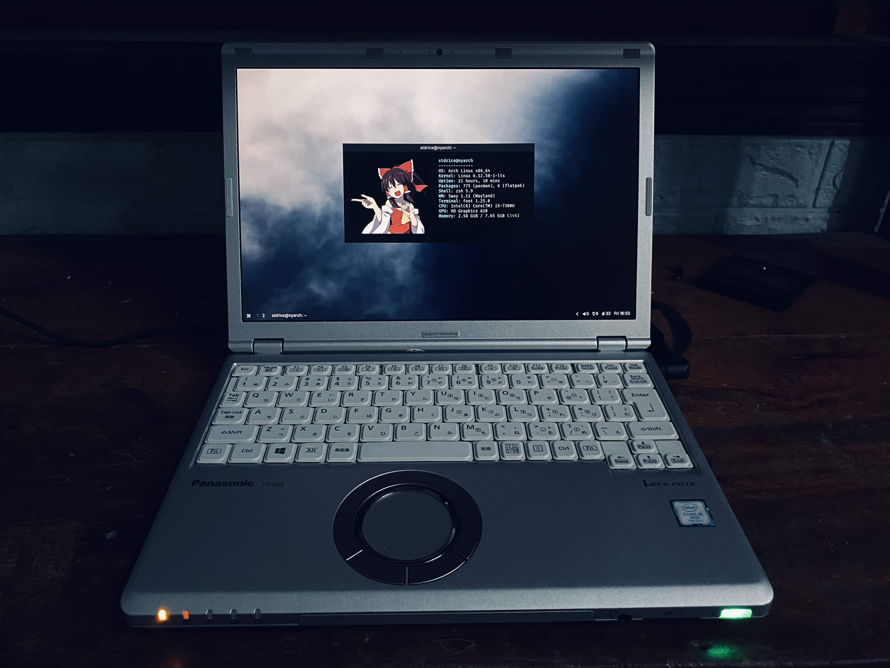

I mainly use it for:
- Web browsing
- Studying
- Coding
- Making music
- And writing this post :D

## Phone
I'm currently using an **iPhone 11**. I got it after a motorbike accident that completely destroyed my previous phone. I wouldn’t say I’m a huge fan of iPhone or iOS, but I can’t deny that it’s really **reliable and stable** for daily use.
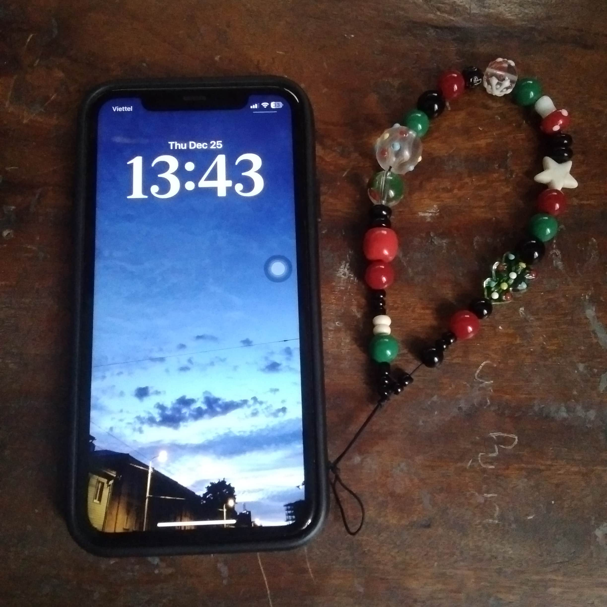

Before this, I used a **Google Pixel 4 XL** and a **Vsmart Active 1**, both of which sadly didn’t survive the accident.
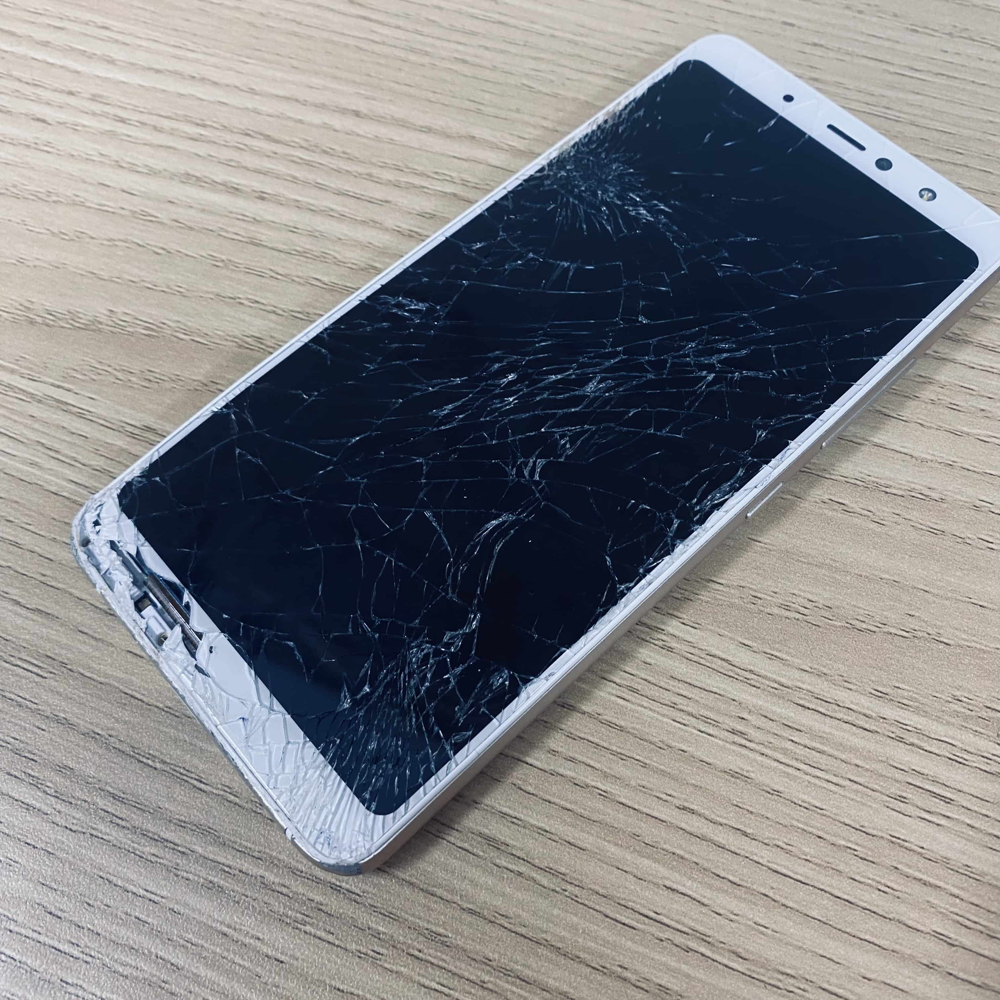

## Tablet
I still can’t live without Android, so I keep using a **Samsung Galaxy Tab A 8.0 (2019)**, a device that’s already 6–7 years old.
After debloating and de-Googling it, the tablet is surprisingly usable despite its low-end specs.
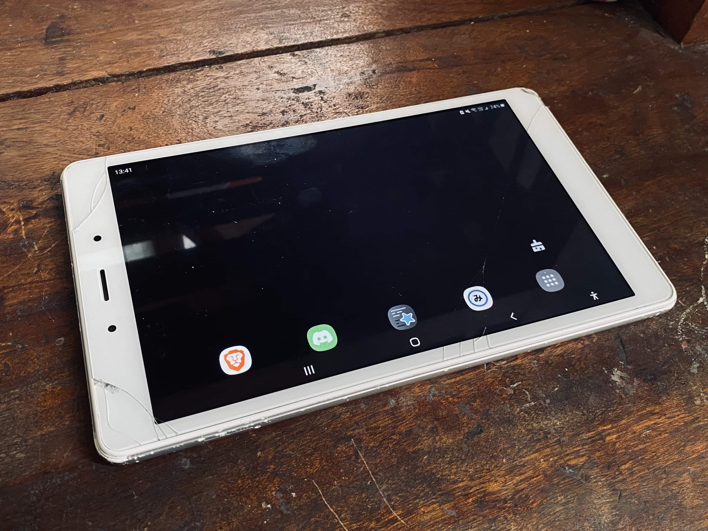

It’s mainly for:
- Reading manga
- Light browsing
- Anki
- Casual Android-specific tasks

# Carry
## Watch
I use a **Xiaomi Band 9 Pro** as my watch. I don't usually connect to my phone, and I mostly use it for telling the time and measuring my biophysical activity (heart rate, SpO2, ...)
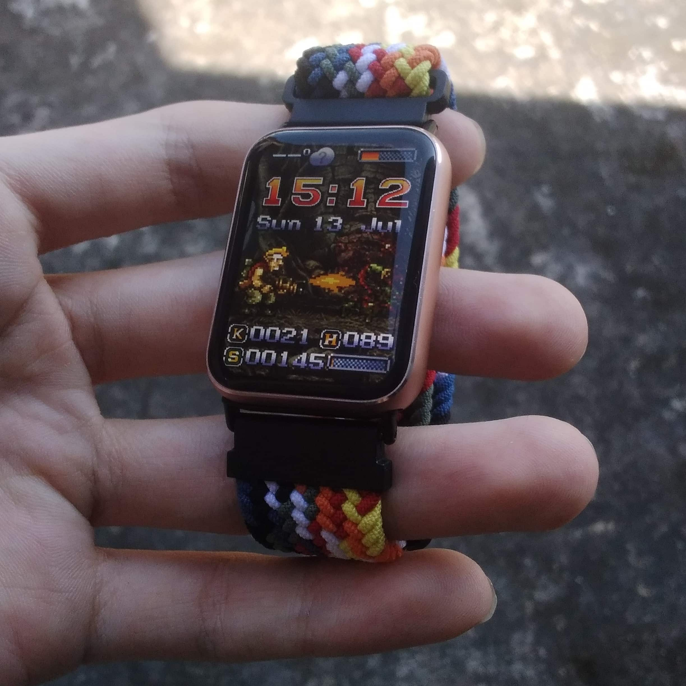

## Bag
I use a backpack from a local brand in my country called **Natoli**. It's pretty dirt cheap ($10) and very durable.
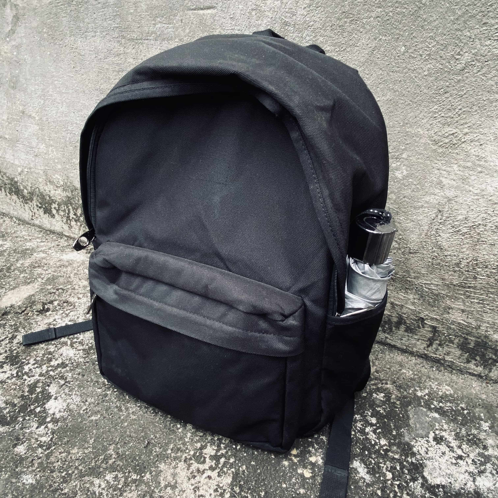

## Wallet
I got this wallet from Shopee and have been using it for the past 2–3 years. I use it for holding cards, keys, and some important documents.
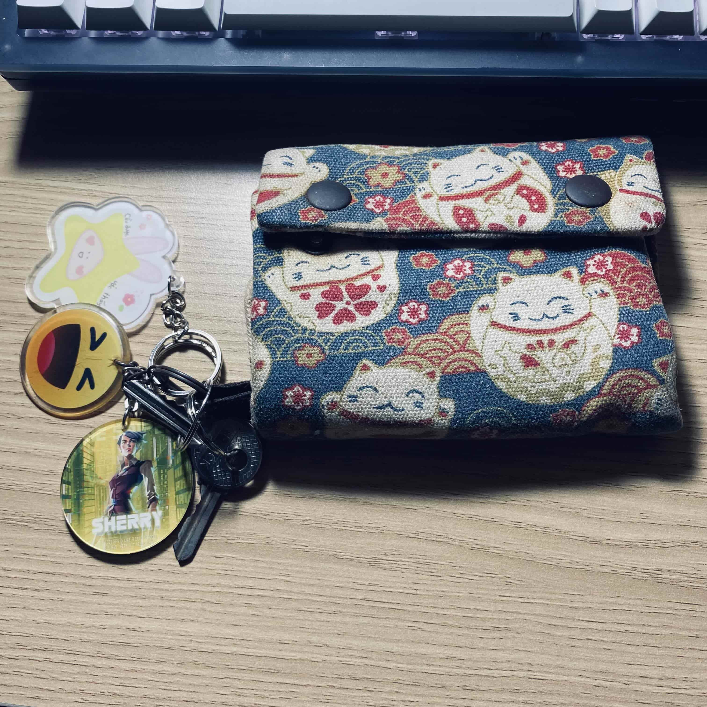

# Audio
Listening to music is one of my hobbies, so I prefer quality over convenience. I usually use wired headphones/earphones instead of TWS.
## Earphones
My main IEM and also my endgame is the **Truthear Hexa**. It has a neutral, studio-grade sound signature and feels very durable.

I also use **Tanchjim Origin** (not mine) and **Truthear Zero:RED**. They’re both excellent in their own ways, but when it comes to daily listening, the Hexa is still my top pick.
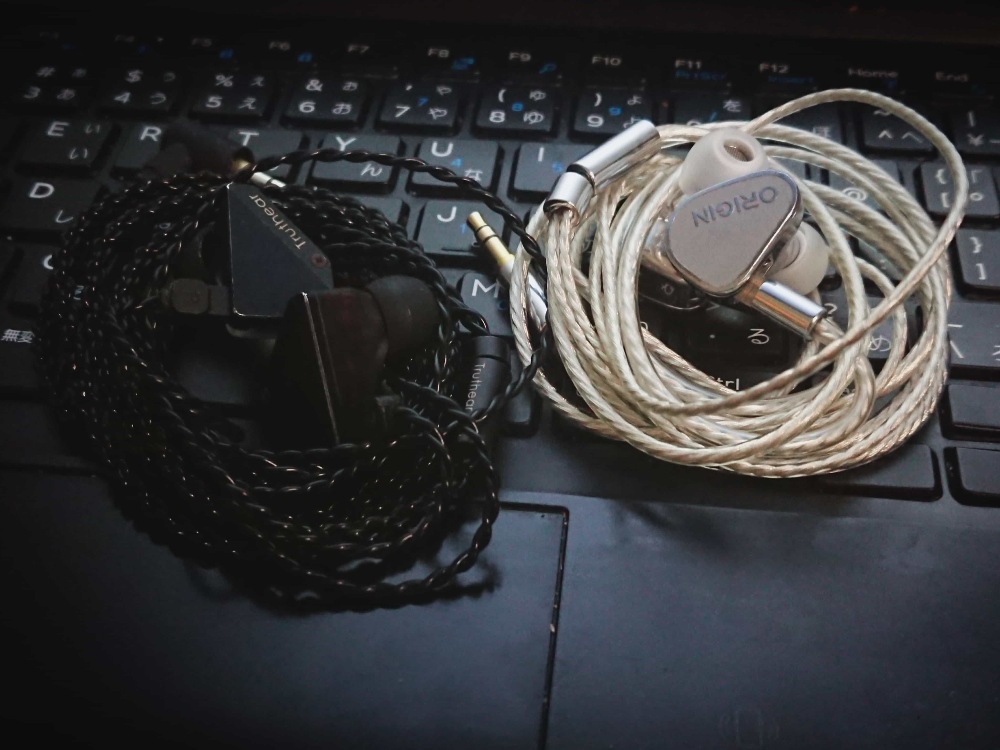
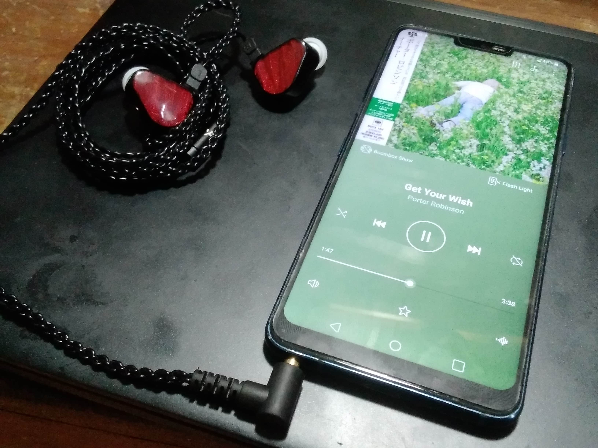

## Output
For audio output, I use the **Moondrop Dawn Pro** as my DAC/dongle. I got it for around **$12**, which makes it an absolute steal.
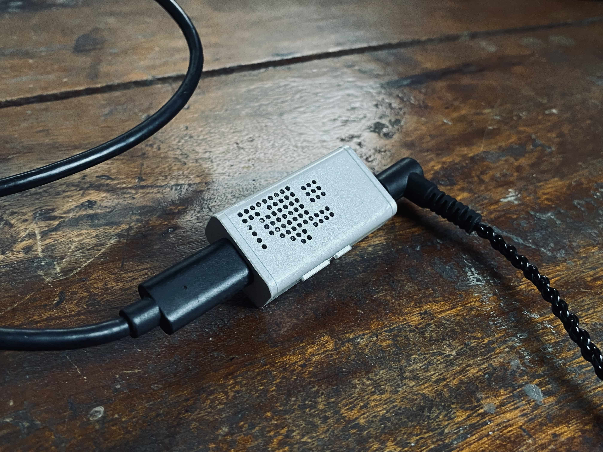

I use it primarily to replace my laptop’s built-in sound card, but it also works as a dongle DAC for my iPhone. Having a single DAC that I can use across multiple devices makes my setup simpler and more consistent, especially when switching between laptop and phone.

# Peripherals
## Keyboard
My daily keyboard is the **Akko ACR64**. It’s compact without sacrificing essential keys, which makes it ideal for both portability and desk use.
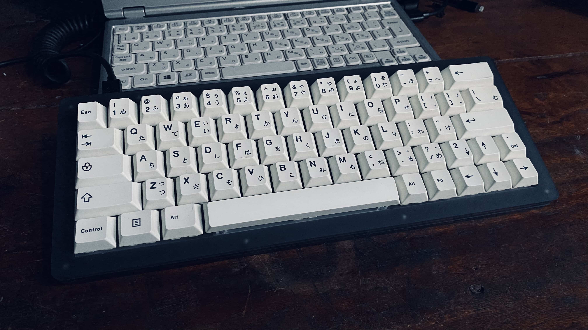

# Stationery
## Pen
For daily writing, I use a **Pilot Kakuno** as my daily driver pen. It’s lightweight, comfortable to hold, and reliable, exactly what I want from a pen I use every day. The nib is really smooth and forgiving, which makes it great for long writing sessions without much fatigue.
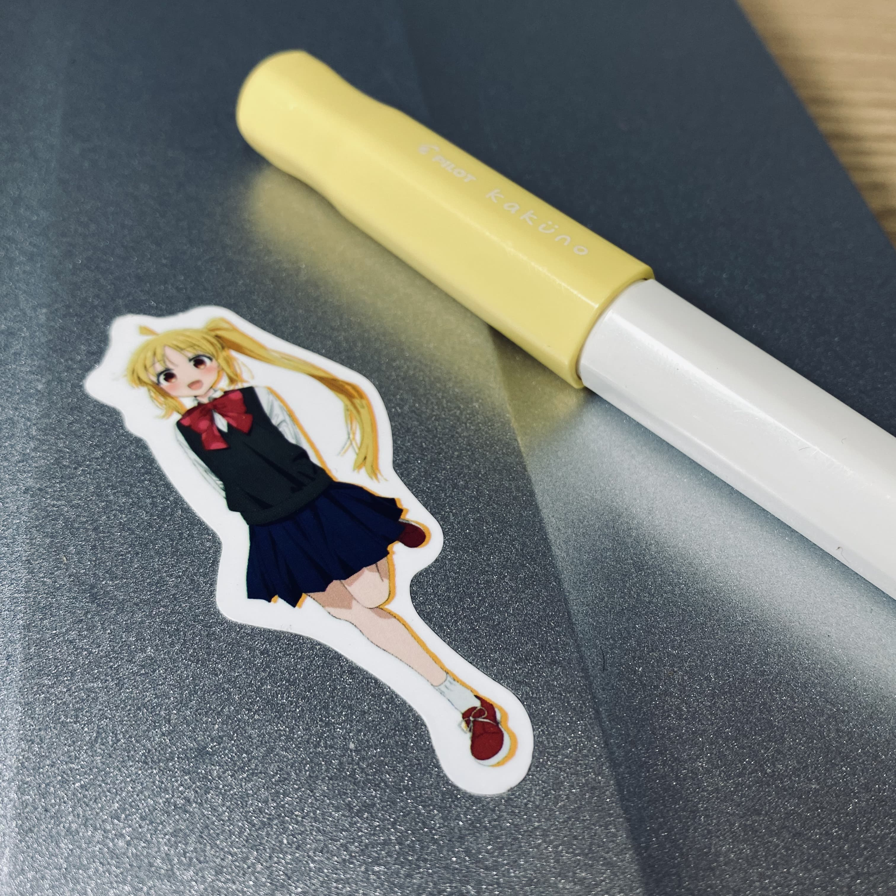

As a backup, I carry a cheap **Deli** ballpoint pen. It’s there for situations where the Kakuno can’t write properly, especially on certain surfaces or low-quality paper. Despite being cheap, it writes surprisingly smoothly and gets the job done when needed.

## Notebook
I don’t really have much choice when it comes to notebooks, since I use my school’s notebook by default, but if I need to choose, I will choose **Kokuyo notebooks** and **Field Notes**.

# Wishlist
- **Wacom CTL-472**: I want to use it as a replacement for both mouse and touchpad. It should be more ergonomic and flexible, especially for long study or work sessions.
- **Lucky65 V2 + Outemu Peach Silent**: A compact mechanical keyboard with VIA support, so I can remap it into an HHKB-style layout. Silent switches are important since I often type in shared or quiet environments.

# Closing
This setup isn’t about having the newest or best gear. It’s about carrying things that fit my budget, my lifestyle, and how I actually use them every day.

As a student who has to travel a lot and live far from home, I value portability, reliability, and gear that simply works.

For now, this EDC does the job, and that matters more to me than constantly upgrading.
