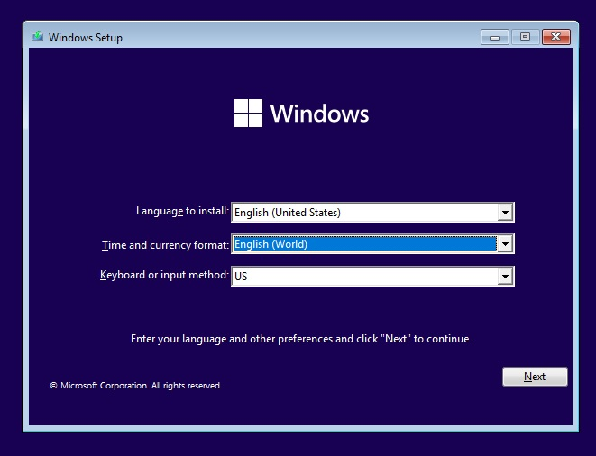

Recently, I had to switch to Windows because of some reasons (my school requires software that is not available on Linux, also I can't configure the projector to work well with Linux). Although the software I use on Linux also works well on Windows, there's a problem: **Windows has too much bloatware**.

This post is a short guide on how I install Windows with as little bloatware as possible.

# Choosing Windows edition
There are two editions I want to mention:

| Edition | Pros | Cons |
|---------|------|------|
| **Consumer (Home, Pro, …)** | Widely supported, latest features | Comes with ads, telemetry, shorter support lifecycle |
| **LTSC / IoT LTSC** | Minimal bloat, no forced feature updates, support up to 10 years | Latest version is only 21H2 (some apps now require 22H2) |

- If your software runs fine on 21H2, go with **IoT LTSC**. Otherwise, stick with Consumer and debloat it manually.  
- Personally, I avoid Windows 11 (basically a reskinned Windows 10). But if you don’t mind the UI, **Windows 11 IoT LTSC** is also an option.
Btw, you can get these Windows editions here: [massgrave.dev](https://massgrave.dev/genuine-installation-media)

# Installation
- For LTSC: install like a normal Windows installation.
- For Consumer: during setup, choose **English (World)** as the time/currency format. It won’t disable telemetry, but it reduces third-party ads. And remember to change the region after install.


# OOBE setup
1. **Do not connect to the Internet yet.**  
   - If there’s no *“I don’t have Internet”* option, press `Shift + F10` and run:  
     ```
     oobe\bypassnro
     ```
     Windows will reboot and show the offline setup option.

2. **Skip Microsoft account login** if you want a clean local user, and don't want to fuck up your user folder.
3. On privacy settings screen, **disable all options**.


# Post-installation tweaks
## Basic
Open **Settings**:
- Go to **Apps -> Installed apps**: uninstall apps that you don't need
- Go to **Privacy & Security**: disable all options in "Windows permissions"

Some apps can't be uninstalled, you can use these commands to remove them (Use Powershell Admin)
```
Get-AppxPackage *XboxGamingOverlay* | Remove-AppxPackage    # Game Bar
Get-AppxPackage *Microsoft.YourPhone* | Remove-AppxPackage  # Your Phone (Phone Link)
Get-AppxPackage *Microsoft.GetHelp* | Remove-AppxPackage    # Get Help
Get-AppxPackage *Microsoft.Tips* | Remove-AppxPackage       # Tips app
```

For Microsoft Edge, you can't uninstall it in a normal way, but you can use this tool to remove it: [ShadowWhisperer/Remove-MS-Edge](https://github.com/ShadowWhisperer/Remove-MS-Edge)

## Advanced
Open **Powershell (Admin)** then type these commands (or just copy-paste if you are lazy) to disable some consumer features and disable all telemetry
```
# --- Registry Policies ---
reg add "HKLM\SOFTWARE\Policies\Microsoft\Windows\DataCollection" /v AllowTelemetry /t REG_DWORD /d 0 /f
reg add "HKLM\SOFTWARE\Microsoft\Windows\CurrentVersion\Policies\DataCollection" /v AllowTelemetry /t REG_DWORD /d 0 /f
reg add "HKLM\SOFTWARE\Policies\Microsoft\Windows\CloudContent" /v DisableWindowsConsumerFeatures /t REG_DWORD /d 1 /f
reg add "HKLM\SOFTWARE\Policies\Microsoft\Windows\CloudContent" /v DisableTailoredExperiencesWithDiagnosticData /t REG_DWORD /d 1 /f
reg add "HKLM\SOFTWARE\Policies\Microsoft\Windows\AdvertisingInfo" /v DisabledByGroupPolicy /t REG_DWORD /d 1 /f
reg add "HKLM\SOFTWARE\Policies\Microsoft\Windows\Windows Error Reporting" /v Disabled /t REG_DWORD /d 1 /f
reg add "HKLM\SOFTWARE\Policies\Microsoft\Windows\Windows Search" /v AllowCortana /t REG_DWORD /d 0 /f
reg add "HKCU\Software\Policies\Microsoft\Windows\Explorer" /v DisableSearchBoxSuggestions /t REG_DWORD /d 1 /f
reg add "HKLM\SOFTWARE\Policies\Microsoft\Windows\DeliveryOptimization" /v DODownloadMode /t REG_DWORD /d 0 /f

# --- Telemetry services ---
Stop-Service DiagTrack -Force
Set-Service DiagTrack -StartupType Disabled
Stop-Service SysMain -Force
Set-Service SysMain -StartupType Disabled
Stop-Service dmwappushservice -Force
Set-Service dmwappushservice -StartupType Disabled
Stop-Service WerSvc -Force
Set-Service WerSvc -StartupType Disabled
Stop-Service RetailDemo -Force
Set-Service RetailDemo -StartupType Disabled
Stop-Service MapsBroker -Force
Set-Service MapsBroker -StartupType Disabled

# --- Telemetry scheduled tasks ---
schtasks /Change /TN "\Microsoft\Windows\Application Experience\Microsoft Compatibility Appraiser" /Disable
schtasks /Change /TN "\Microsoft\Windows\Application Experience\ProgramDataUpdater" /Disable
schtasks /Change /TN "\Microsoft\Windows\Autochk\Proxy" /Disable
schtasks /Change /TN "\Microsoft\Windows\Customer Experience Improvement Program\Consolidator" /Disable
schtasks /Change /TN "\Microsoft\Windows\Customer Experience Improvement Program\UsbCeip" /Disable
schtasks /Change /TN "\Microsoft\Windows\DiskDiagnostic\Microsoft-Windows-DiskDiagnosticDataCollector" /Disable
schtasks /Change /TN "\Microsoft\Windows\Feedback\Siuf\DmClient" /Disable
schtasks /Change /TN "\Microsoft\Windows\Feedback\Siuf\DmClientOnScenarioDownload" /Disable
schtasks /Change /TN "\Microsoft\Windows\Maps\MapsUpdateTask" /Disable
schtasks /Change /TN "\Microsoft\Windows\Windows Error Reporting\QueueReporting" /Disable
schtasks /Change /TN "\Microsoft\Windows\Power Efficiency Diagnostics\AnalyzeSystem" /Disable

# --- Block telemetry with hosts file ---
Add-Content "$env:windir\System32\drivers\etc\hosts" "0.0.0.0 telemetry.microsoft.com"
Add-Content "$env:windir\System32\drivers\etc\hosts" "0.0.0.0 watson.telemetry.microsoft.com"
```

# Recommended software alternatives
After cleaning Windows, you’ll probably want to replace Microsoft’s built-in apps with lighter and better alternatives:

| Category       | Built-in app                 | Alternative                                   |
|----------------|-----------------------------|-----------------------------------------------|
| **Browser**    | Microsoft Edge              | Firefox, LibreWolf, Brave                     |
| **Office**     | Microsoft 365 (trial nags)  | LibreOffice, OnlyOffice                       |
| **Media player** | Movies & TV / Groove Music | VLC, MPV, MPC-HC                              |
| **Photos**     | Photos app (slow, ads)      | ImageGlass, nomacs                            |
| **Notepad**    | Notepad / WordPad           | Classic Notepad, Notepad++, Kate              |
| **Compression** | Built-in zip (limited)     | 7-Zip, PeaZip                                 |
| **App Store**  | Microsoft Store             | Chocolatey, Winget, Scoop (package managers)  |

# Conclusion
If you need Windows but hate the bloat:
- Prefer **IoT LTSC** whenever possible. It’s stable, minimal, and supported for up to 10 years.
- If you must stick with **Consumer editions**, follow the debloating steps above (OOBE tricks, disabling telemetry, uninstalling unnecessary apps).

For me, **Windows will never be as lean as Linux**, but with the right setup it can be clean, private, and fast enough for real work. At the end of the day, the best operating system is the one that lets you get things done without getting in your way.
