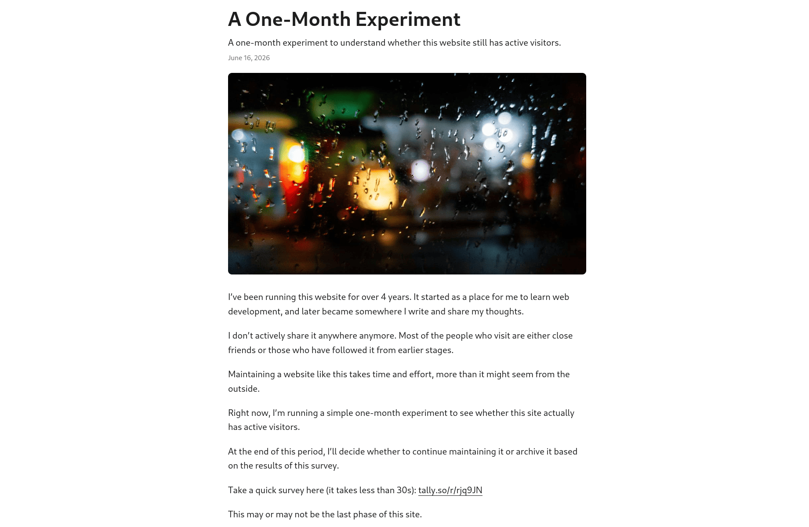

About a month ago, I added a small survey to my website to understand who visits my site, how they found it, and whether my content was useful.

I didn't expect many responses because this is just a personal website with a small audience. However, the results were more interesting than I expected.

| Metric                 | Result |
| ---------------------- | ------ |
| Visits                 | 11     |
| Survey responses       | 2      |
| Unique respondents     | 2      |
| Average visit duration | 16s    |

The numbers are small, but for a personal website without active promotion, I consider this a positive result.

Interestingly, the visitors didn't come from search engines this time. They came from personal connections and social platforms.

This small survey gave me more motivation to continue writing. Even though the number of visitors is still small, knowing that there are real people reading my work makes the effort feel meaningful.

I will continue writing about the things I care about, improving the website along the way, and sharing my experiences and thoughts through this blog.

A small audience is still an audience, and I'm glad that this little corner of the internet has reached someone.
