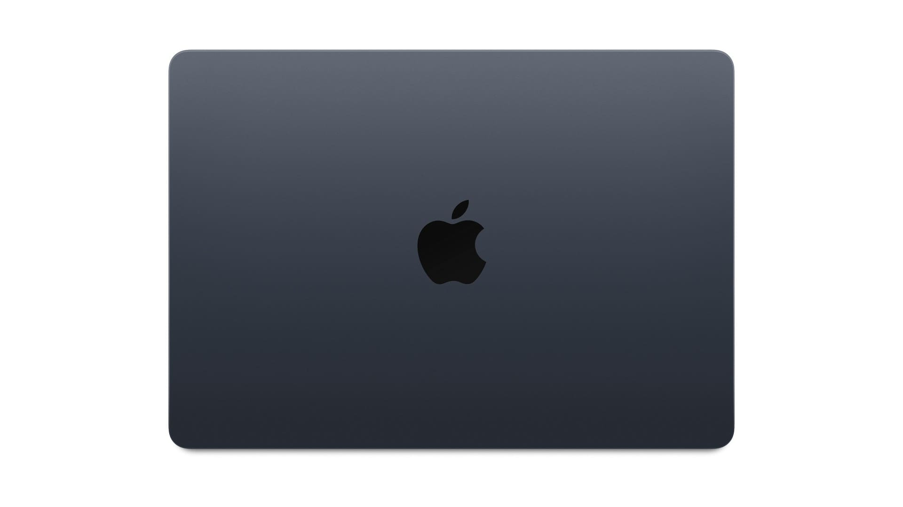
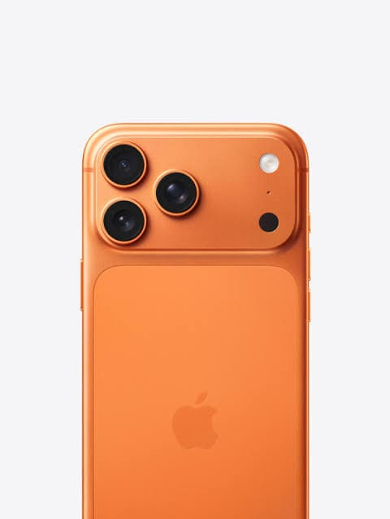
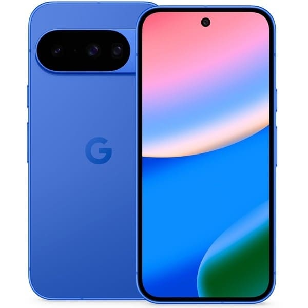
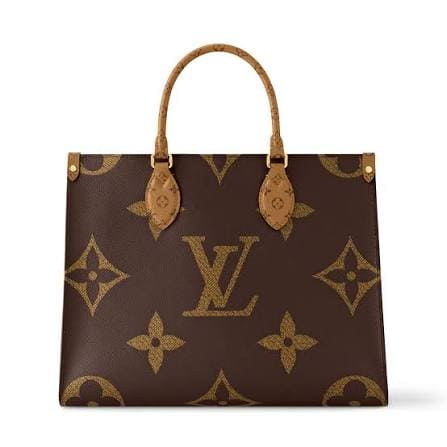
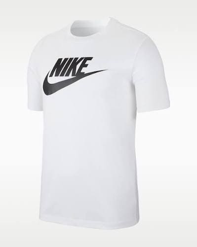
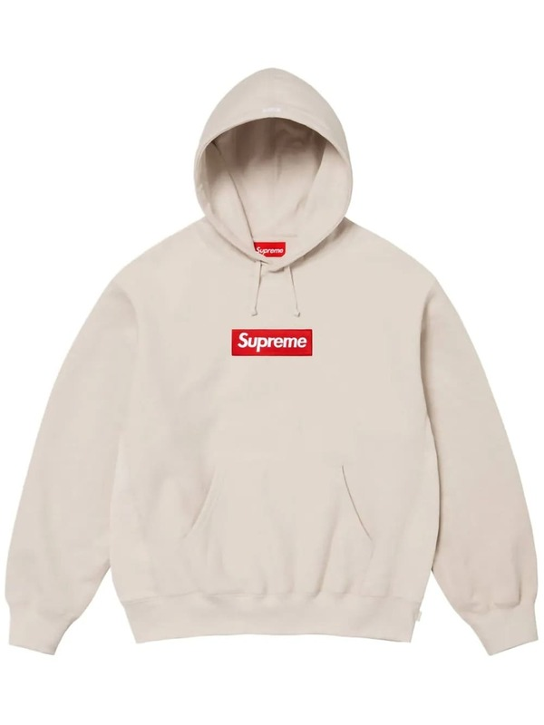
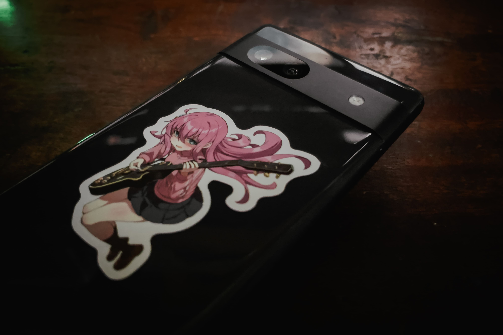
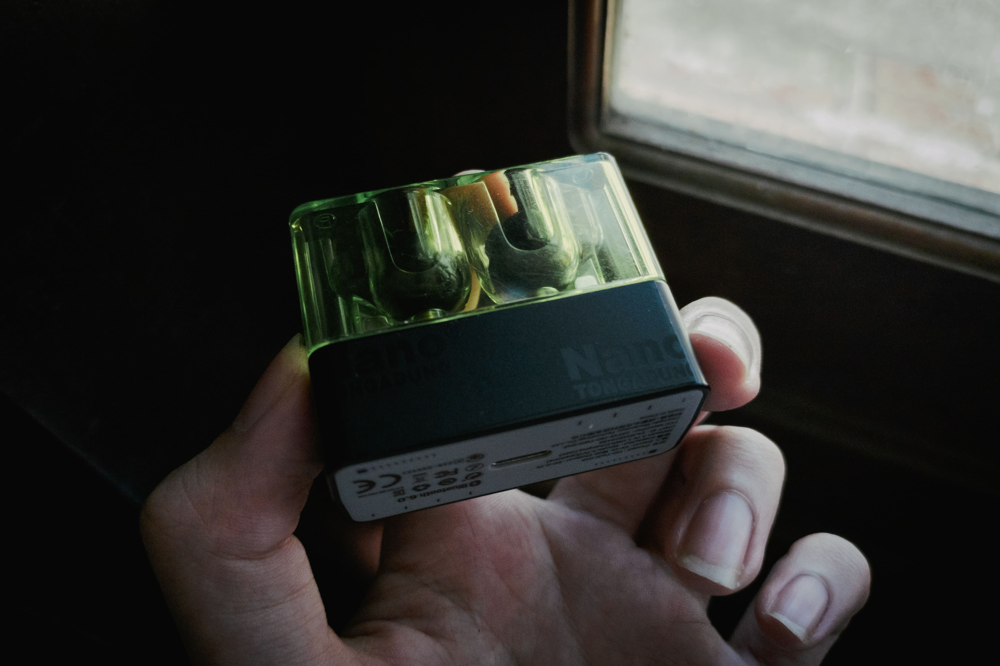
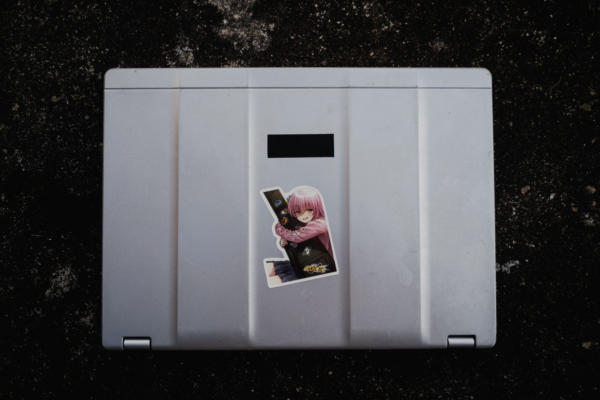
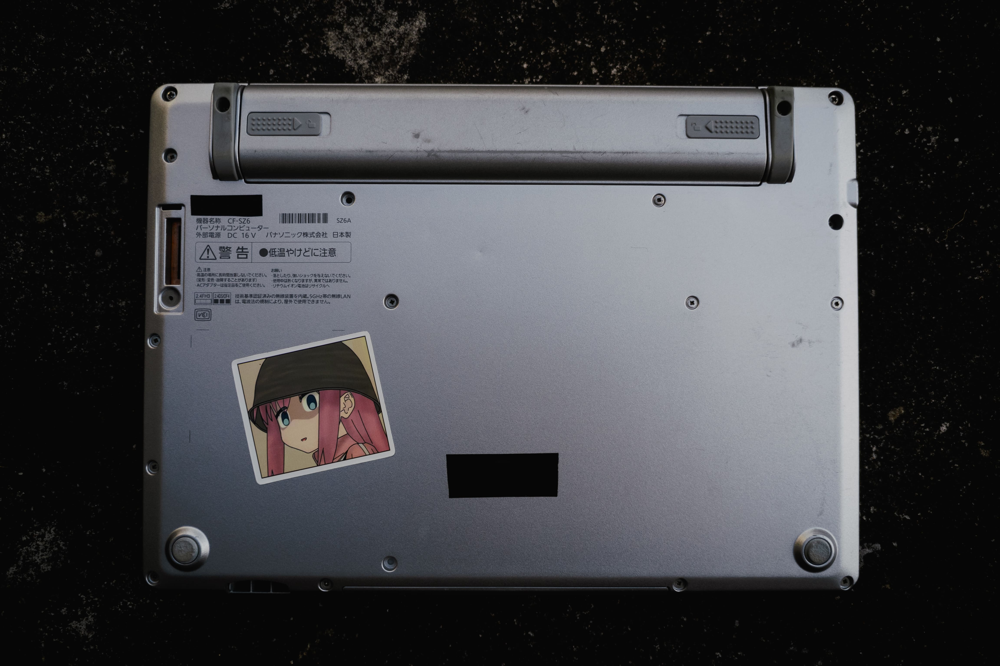

Nowadays, logos are very important to companies. They help people recognize a brand, and they also turn customers into free advertising.

However, after buying a product, I usually cover the logo. Why?

# Aesthetics
Think about it: does a product with a huge logo on it actually look good?
| | | |
| --- | --- | --- |
|  |  |  |

With almost every product, I prefer clean and simple designs. A product without a logo is usually better. If there is a logo, it should be subtle and fit naturally with the overall design. If it does not, I will cover it.

# Anti-branding
I dislike buying products just because of the brand, and I dislike the mindset of choosing something only because of its name. For me, I choose products because I like them, not because of the brand behind them.

Interestingly, some people do the opposite. They intentionally make logos as visible as possible, almost as if the logo itself is the product.
| | | |
| --- | --- | --- |
 |  |  |

I am not that kind of person. I don't want my belongings to become advertisements for a company. The value of a product should come from what it does, not from the name printed on it.

# Privacy
A logo can reveal what someone is using. I do not want people to know which brand my devices are from, it's not important. A device is just a tool.

# Ownership
By removing the most obvious connection to the original brand, the product becomes more personal. It is no longer just "a product from a company", it becomes my own device. I can modify it, customize it, and use it however I want.

# How I cover logos
I usually use black tape or stickers.
- **Black tape**: It gives a "redacted" feeling, like something hidden in a classified document. It looks simple and mysterious.
- **Stickers**: They show the personality of the user and make the product feel more unique.

# Conclusion
**Tape the logo**.
| | |
| --- | --- |
|  |  |
|  |  |