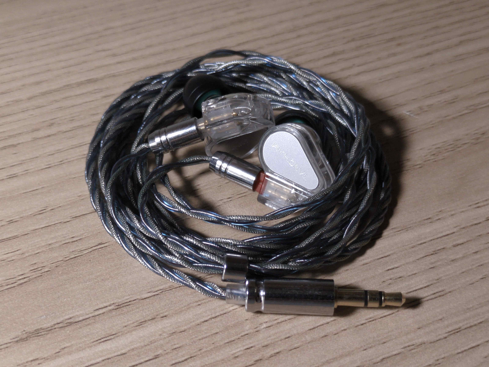
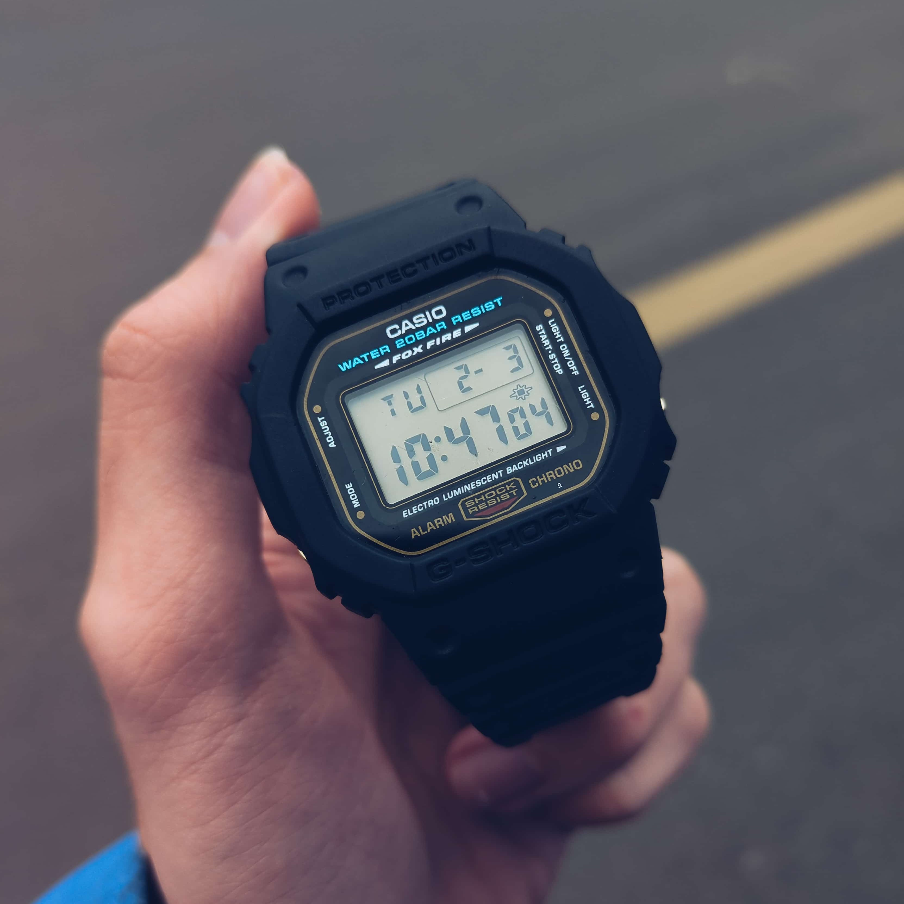
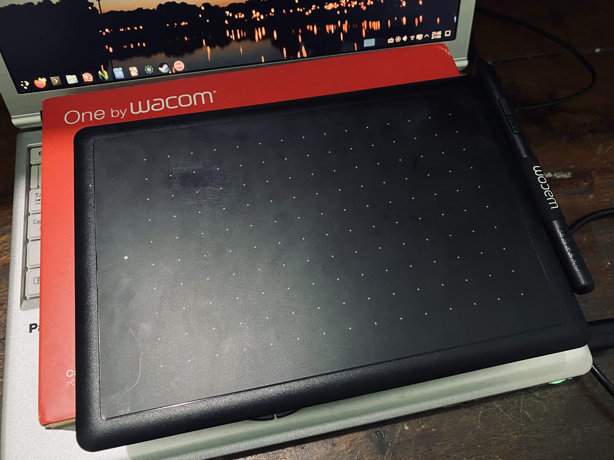
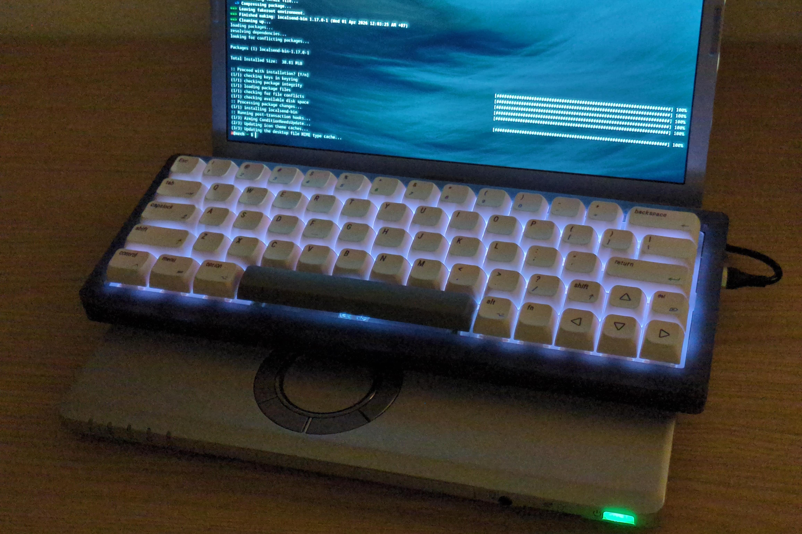
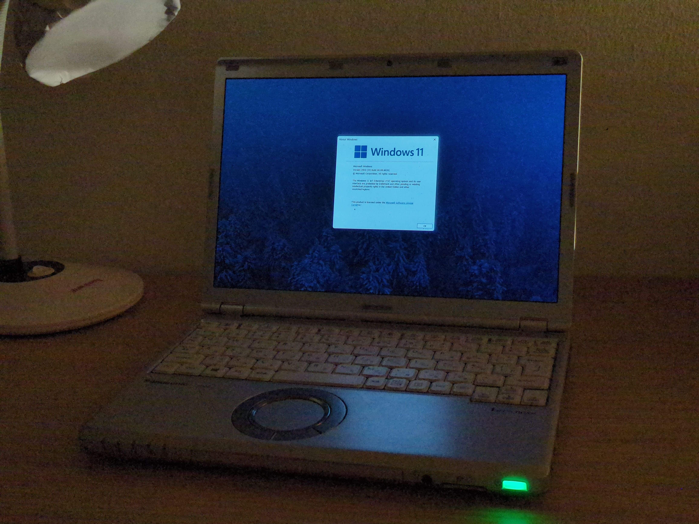

This is my first time writing a post like this. I will use this to share updates about my life and whatever I want to talk about.

# Hardware
## Audio
I’ve been into the audio hobby for about 2–3 years. Recently, I sold all of my gear (headphones, DAC/AMPs, cables, etc) and went back to something super cheap: the Tanchjim Bunny ($10 / 200.000 VND).

Honestly, it surprised me. It sounds like 70-75% of a flagship (Tanchjim Origin), and it even feels more natural than my old Truthear Hexa. At that point, spending more didn’t really make sense anymore.

## Watches
At the start of the year, I bought a G-Shock DW5600 to replace my Mi Band 9 Pro and Mi Band 10. But I’m probably going to sell it soon and switch to a Casio A158, which is lighter, simpler, and better for daily wear.

## Peripherals
I also bought a Wacom tablet… and then sold it.\
The plan was to use it instead of a mouse and maybe draw or write a bit. Turns out it was more annoying than useful. I barely used it for drawing or writing, mostly just played osu! with it. I ended up selling it to a Discord friend, and they seem happy with it.

For keyboards, I recently found something called “sonshi-style”, basically putting a separate keyboard on top of a laptop keyboard.

My setup wasn’t perfect though. The USB-C port was getting blocked by the screen, and the Cherry profile keycaps were too tall for me to type comfortably. So I fixed it by getting a 90-degree Type-C cable and switching to XDA keycaps.

## Photography
Lately, I’ve also been getting into photography. I can’t really afford a proper camera yet, but I always have my phone with me. With the [ProShot app](https://play.google.com/store/apps/details?id=com.riseupgames.proshot2), it’s actually “good enough” to use like a camera.

| | |
| --- | --- |
|  |  |
|  |  |

That said, there are still some clear hardware limitations, especially when it comes to sensor size, detail when zooming, and overall image consistency compared to a dedicated camera. It’s usable, but not something I can fully rely on yet.

I’ll probably get a proper camera soon.

## OS
I also ended up dual-booting Windows after a long time using Linux full-time. The main reason is I need apps like Lightroom and FL Studio, and Linux alternatives just aren’t good enough for what I want.

# Internet
I quit Discord and paused several online relationships because of conflicts. Right now, I’m only keeping a few connections that I actually think are worth it.

At the same time, in my real-life persona, I’ve been using more mainstream social media. It’s for different reasons, and it’s completely separate from this one.

At some point, I might just disconnect from the internet for a while and focus more on real life.

# Life
Like I mentioned earlier, I’ve been selling off a lot of my stuff and replacing it with cheaper options that do basically the same thing.

I’m slowly going back to a more minimal lifestyle. Not for aesthetics, just for practical reasons. Less stuff means less to think about and less money spent.

I’m also trying to avoid wasting money on things that don’t really matter anymore: subscriptions, random hobbies, stuff like that, etc.

Lately, one of the simplest things I enjoy is just watching my bank account slowly grow. Maybe it sounds dumb, but it’s a small kind of joy for me right now.

Happy April Fools, I guess. Nothing here is a joke though.
