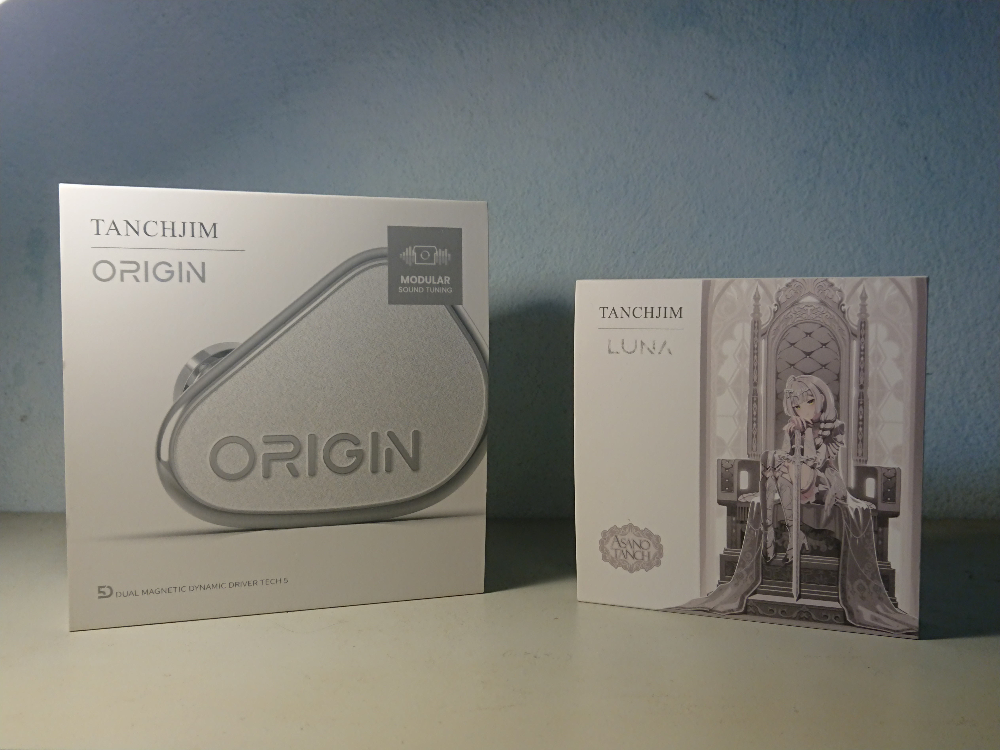
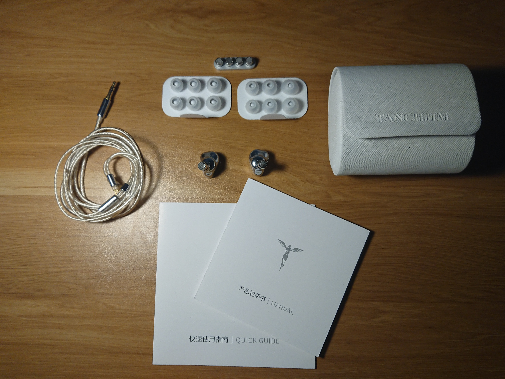
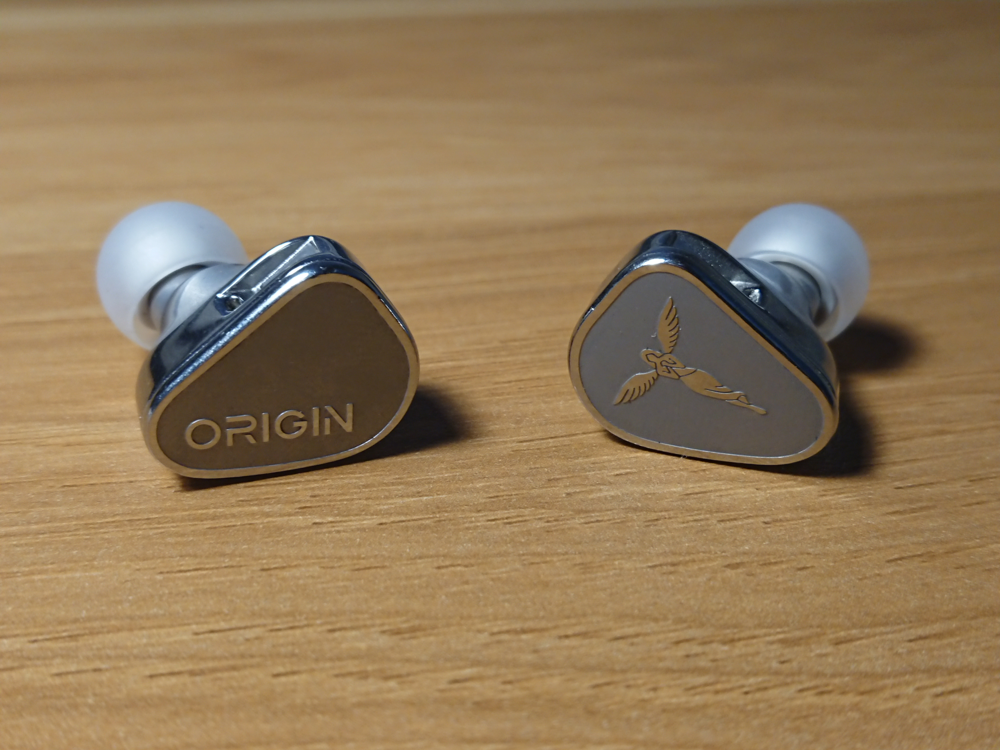
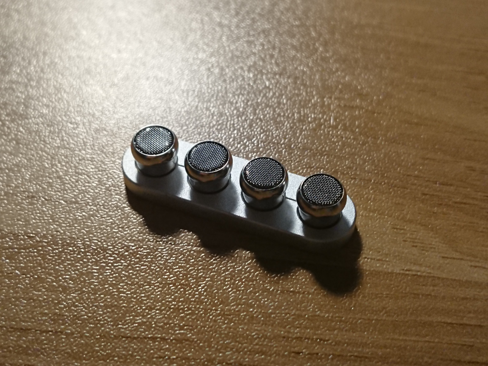
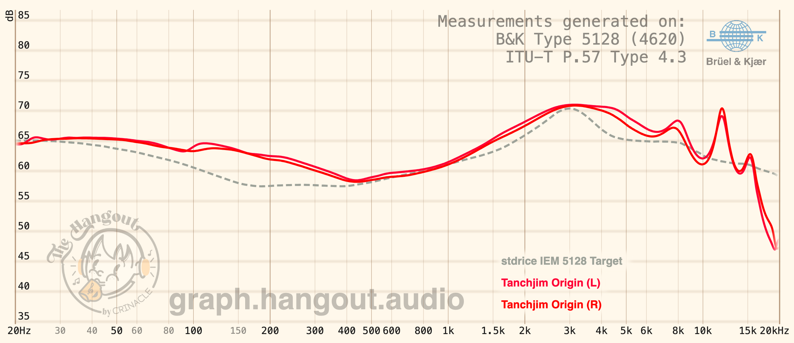

Trong thế giới tai nghe IEM đang “nhiễu loạn” với đủ kiểu tuning, filter, driver hybrid... thì Tanchjim Origin chọn một con đường khác: đơn giản, tinh tế, và tập trung toàn lực vào trải nghiệm nghe. Chỉ một driver dynamic duy nhất, Origin không phô trương, không cầu kỳ nhưng lại mang đến chất âm trung tính, mượt mà và chi tiết đến bất ngờ.

# Thông tin
- Driver: 1DD
- Được gửi bởi @cheesedustyvoxx không để viết bài này

# Nguồn phát sử dụng
- Điện thoại: Sony Xperia XZ1
- DAC/AMP: Tanchjim Luna Asano Tanch
- Nguồn nhạc: local files, YouTube Music

Sau khi trải nghiệm thì mình thấy em Origin này có thể dùng với nguồn phát nào cũng được. Để trải nghiệm hoàn hảo hơn thì có thể sử dụng chính Tanchjim Luna của hãng. 

# Mở hộp và phụ kiện
Hộp của Tanchjim Origin đơn giản, mặt trước in tên và hình sản phẩm, mặt sau in thông tin và dải tần đáp ứng của Origin. Tuy đơn giản vậy nhưng cảm giác mở hộp lại vô cùng sang trọng.

Đi kèm trong hộp có: 2 bộ tips T-APB (treble và bass), hộp đựng tai, cọng dây 2 pin 3.5mm, 2 bộ filter đi kèm thêm. Bộ tips đi kèm đeo khá thoải mái, chưa cần thay tips vội. Dây stock bọc lớp trong suốt giống DM480, hoàn thiện tốt, 2 pin siêu dài nhưng vẫn có thể dùng cho IEM khác, chỉ tiếc là cáp chỉ có 3.5mm chứ không có 4.4mm hoặc module. Hộp đựng đi kèm khá cứng, trắng muốt, đẹp nhưng hơi dễ bẩn chút. Nhìn chung thì bộ phụ kiện đi kèm khá ngon nên khi mua về không cần "1 tiền gà 3 tiền thóc".

# Thiết kế
Origin mang cho mình thân hình khá nhỏ nhắn nhưng cực kì chắc chắn. Toàn bộ phần housing được hoàn thiện bằng thép không gỉ rất cứng cáp và sang trọng. Faceplate khắc chữ "Origin" bên tai trái và logo của Tanchjim bên tai phải. Điểm trừ duy nhất ở thiết kế của em này có lẽ là dễ xước dăm và bám vân tay nên cần giữ cẩn thận chút và lau chùi thường xuyên. 

Mới đầu khi nhìn trên ảnh thì mình nghĩ Origin sẽ rất to, nhưng sau khi được đeo và cầm trên tay thì mình thấy Origin chỉ nhỏ tầm em Moondrop Chu 2. Trọng lượng của housing khá đầm/nặng, cầm trên tay có cảm giác chắc chắn, nhưng khi đeo thì sẽ không ảnh hưởng nhiều đến trải nghiệm.

# Về Tuning Filters
Tanchjim Origin có hệ thống tune âm bằng filter tháo rời (được quảng cáo ngay trên vỏ hộp). Có 3 loại filter trong hộp là S (Standard), D (Dynamic) và L (Light). 

Tuy nhiên, theo trải nghiệm của mình thì cả 3 filter này đều không mang lại sự khác biệt (hoặc sự khác biệt rất nhỏ) nên trong bài này mình sẽ sử dụng loại S (là loại được gắn sẵn) trong bài này.

# Chất âm
Tanchjim Origin mang cho mình màu âm trung tính hơi thiên hướng sáng, nhấn mạnh vào giọng hát. Đây cũng là một trong những IEM thiên vocal hay nhất mình từng nghe.

Mới đầu nhìn trên dải tần đáp ứng, mình nghĩ Origin là một em tai có bass khá mềm, nhưng hoàn toàn không phải như vậy. Dải Bass của Origin đáp ứng tốt với nhu cầu của mình, đủ độ vui cho nhiều thể loại nhạc. Bass đánh rất chặt, rất lực nhưng vẫn gọn gàng, kiểm soát tốt, tốc nhanh, không có hiện tượng bị lấn sang dải trung. Subbass bị roll-off nhẹ nên dải bass sẽ tập trung vào độ punchy hơn là rền.

Điểm mạnh nhất của Origin chắc chắn nằm ở dải Mid. Mid thiên về "ngọt" hơn là "thanh", được tái tạo rất tốt, âm sắc tự nhiên, mượt mà nhưng vẫn chi tiết. Lower Mid khá dày, có chút hơi ấm, giọng nam và nhạc cụ trầm được thể hiện khá tròn vai, có độ "gằn". Upper Mid được đẩy lên vừa đủ, sáng nhưng không quá chói. Giọng nữ nghe rất ngọt ngào, thanh thoát. Nhạc cụ cao rất chi tiết, nghe rất phê.

Dải Treble của Origin theo tai mình thì được tune hơi an toàn. Treble nghe mượt, êm tai, thoáng đãng, lượng chi tiết và phần mở rộng vừa đủ, sparkly nhưng không quá sib. Tuy nhiên với những người đã nghe quen những mẫu IEM âm tối thì dải treble của Origin sẽ hơi sắc và chói tai. Thậm chí nếu dải treble này chưa làm hài lòng thì có thể thử Pentaconn Coreir AL Alloy, dải treble sẽ trở nên sắc và chi tiết hơn.

Về khoản kỹ thuật, đây cũng là điểm mạnh của Origin so với những đối thủ khác, mặc dù chỉ sử dụng duy nhất 1DD. Âm trường rất thoáng đãng và có chiều sâu, có lẽ cũng nhờ hệ thống thoát khí gần connector. Âm hình định vị chính xác, khả năng tách giọng hát và nhạc cụ rõ ràng. Nhìn chung là kĩ thuật của Origin rất tốt với một mẫu 1DD IEM.

# Tổng kết
Với mức giá khoảng $200 thì Tanchjim Origin có đáng không? Chắc chắn là có! Với những người muốn một em IEM màu âm trung tính, dễ kéo, dễ nghe, đặc biệt nhấn mạnh vào giọng hát và nhạc cụ, Tanchjim Origin là sự lựa chọn hoàn toàn đáng giá.
