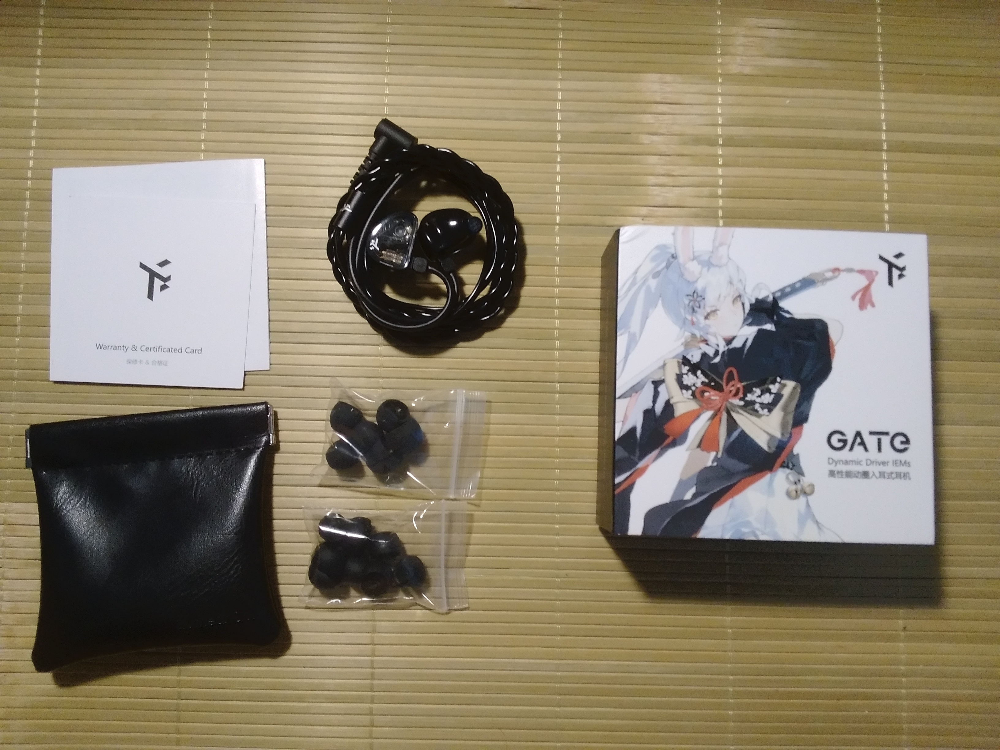
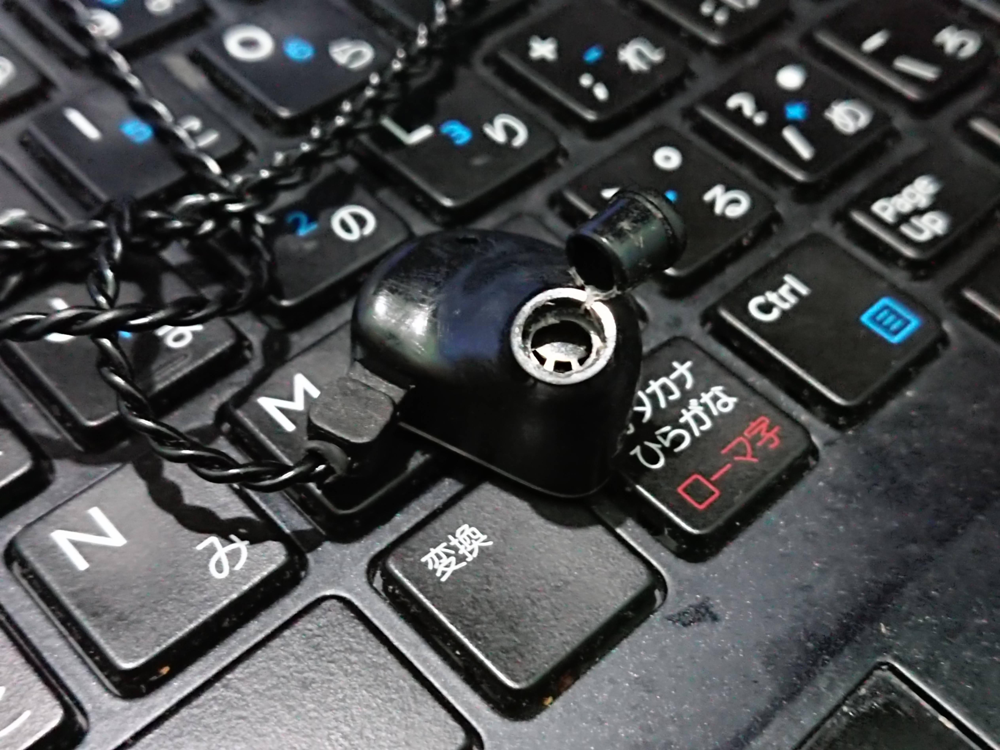
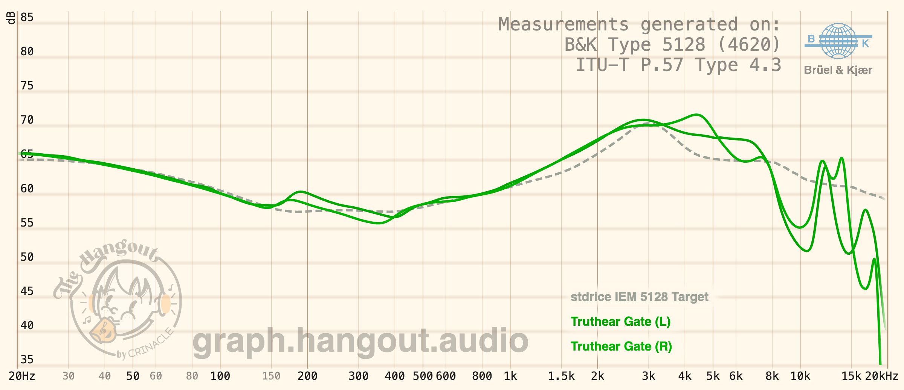

Truthear Hola từng là một cái tên rất được yêu thích trong phân khúc tai nghe giá rẻ, nhờ chất âm U-shape dễ nghe và chất lượng tốt trong tầm giá. Tuy nhiên, Hola đã bị Truthear khai tử, khiến nhiều người phải tìm kiếm lựa chọn thay thế khác.

Và Truthear Gate đã xuất hiện, là bản kế nhiệm của Hola, như một "cổng chào" đón nhận người chơi audio mới. Vậy nó có thể làm tốt vai trò “người kế nhiệm” Hola không, hoặc ít nhất là một lựa chọn thay thế hợp lý? Dưới đây là cảm nhận của mình về Truthear Gate.

# Thông tin
- Cấu hình: 1DD
- Giá: 350.000 VND

# Mở hộp
Hộp của Gate đóng hộp khá giống với những sản phẩm Truthear khác, tuy nhiên hộp của Truthear Gate lại nhỏ gọn và đáng yêu hơn nhiều. Bên trong hộp gồm có:
- 1 cặp tai nghe gắn sẵn dây đồng OFC 2-pin
- 1 túi đựng bằng da PU
- 1 bộ tips ống rộng (SS, S, M, L), 1 bộ tips ống hẹp (S, M, L)
- Tờ hướng dẫn sử dụng và bảo hành

Nhìn chung thì phụ kiện của Gate khá đơn giản, nhưng chất lượng lại hơn nhiều sản phẩm khác cùng giá. Dây cáp rất xịn, xịn hơn dây cáp của nhiều tai nghe đắt tiền hơn, được đan 2 lõi, chống rối tốt, có mic, tuy nhiên hơi dính. Tips đeo mềm, mịn, chưa cần thay tips mới ngay. Túi đựng đẹp, sờ rất đã nhưng hơi nhỏ, cần phải quấn tai nghe gọn 1 chút mới nhét vừa.

# Thiết kế và cảm giác đeo
Thiết kế của Gate rất đơn giản. Cả phần housing và faceplate đều được hoàn thiện bằng nhựa bóng. Faceplate trong suốt hoàn toàn, nhưng vì cấu hình driver em này chỉ có 1DD nên nhìn khá "phèn". Nhìn ngoài đời thì em nó đẹp hơn khá nhiều so với trên ảnh.

Vì housing được làm bằng nhựa và khá nhỏ gọn nên có thể nói luôn là Gate nhẹ hơn khá nhiều so với nhiều sản phẩm khác. Ống dẫn âm khá to, tầm Hexa, tuy nhiên thì khi chọn đúng size tips thì đeo vừa tai và rất thoải mái nên không cần quá lo về độ thoải mái khi sử dụng em tai nghe này.

Chất lượng hoàn thiện khá tệ, khá dễ xước và bám vân tay. Các chi tiết được dán keo hơi cẩu thả, nhiều chỗ hở, nên khá lo ngại về tính lâu dài của em nó.

# Chất âm
Truthear Gate mang màu âm trung tính hơi thiên sáng nhẹ, có phần nào đó tương tự Moondrop Lan.

Gate mang một lượng bass vừa đủ, không quá nhiều, tập trung vào Subbass. Subbass xuống khá sâu, rumbly. Tuy nhiên midbass đánh hơi thiếu lực, xuống không sâu lắm. Tốc bass không quá nhanh, nhưng kiểm soát khá tốt nên không bị lấn sang dải khác.

Mid khá tự nhiên, trung tính, không quá lùi mà cũng không quá tiến. Âm sắc tự nhiên và hài hòa. Lower Mid hơi mỏng, nghe vocal nam hay bass guitar không quá hay. Upper Mid khá trong trẻo, vocal nữ nổi khối. Nhạc cụ như guitar, violin được thể hiện tốt. Tuy nhiên phần 4k-6k được đẩy lên khá nhiều nên với một số người sẽ hơi shouty.

Dải treble của em này tune khá kì, thụt ở đoạn 10-12k nhưng lại đẩy 14k lên. Mình đang ghét nó hơn là thích, làm mọi thứ bị compressed lại. Mặc dù vậy thì treble khá mượt và an toàn, khi nghe thì sẽ không thấy chói, gắt hay sib. Tuy nhiên vì tune an toàn và hơi thiếu phần mở rộng nên treble khá khô, cũng như hơi metallic.

Trong tầm giá này thì tính kĩ thuật không được quá cao, Gate cũng tương tự vậy. Âm trường khá thoáng đãng, cân bằng giữa độ rộng và độ sâu. Âm hình định vị và tách lớp ở mức trung bình-tốt, không có gì quá nổi bật.

# Tổng kết
Nếu bạn mới chơi IEM, cần 1 em IEM trung tính để nghe nhiều thể loại nhạc hoặc nghe nhạc J-Pop, J-Rock mà chủ yếu có vocal nữ thì Truthear Gate sẽ là một lựa chọn rất hợp lí. Truthear Gate cũng là mẫu IEM giá rẻ hiếm hoi mang màu âm trung tính thay vì V-Shape như nhiều mẫu IEM khác nên rất đáng để chơi.
