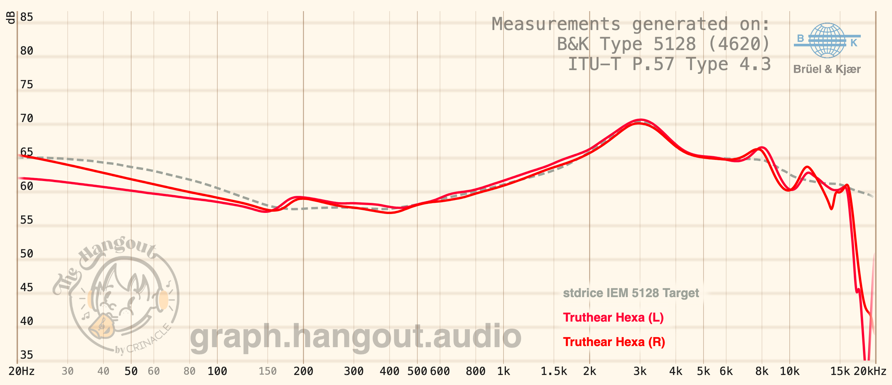

Trong một rừng IEM đang ngày càng bão hòa bởi V-shape hay thiên hướng Harman thì Truthear Hexa chính là làn gió mới. Không màu mè, không đẩy dải nào lên quá cao, Hexa được tinh chỉnh theo hướng cân bằng, trung tính, phù hợp cho những ai muốn thưởng thức âm nhạc một cách chân thật.
Vậy Hexa có thật sự là “con bài chiến lược” của Truthear trong phân khúc entry? Dưới đây là những chia sẻ của mình về Truthear Hexa.

# Thông tin
- Driver: 1DD + 3BA
- Giá: 1.450.000VNĐ

# Mở hộp
Hộp của Truthear Hexa mang lại cảm giác cao cấp khi mở. Bên ngoài là hình gái alime tai thỏ với vài thông số kĩ thuật. Bên trong hộp của Truthear Hexa gồm có:
- Truthear Hexa (cảm ơn Caption Obvious)
- Túi đựng da: khá lớn, đựng được nhiều thứ ngoài IEM
- Dây tai nghe: 2pin chuẩn 3.5SE đồng mạ bạc 4N, hơi dễ rối
- 7 cặp tips (3 cặp ống hẹp, 3 cặp ống rộng, 1 cặp foam)
- Standee gái alime
- Sách HDSD, thẻ bảo hành

# Thiết kế, phụ kiện đi kèm và cảm giác đeo
Build quality của Truthear Hexa khá ổn trong tầm giá. Faceplate được làm bằng hợp kim nhôm phun cát, còn housing làm bằng nhựa nhám trong mờ, được in 3D bởi HeyGears (công ty chuyên in 3D và đã từng tham gia sản xuất Blessing 2), nhìn được hệ thống driver bên trong. Mặc dù nhìn bên ngoài khá góc cạnh nhưng bên trong Truthear Hexa đã được bo góc mềm mại để tạo cảm giác thoải mái hơn.

Dây stock làm bằng đồng mạ bạc 4N, đan 4 lõi, chất lượng khá tốt, hơi dễ rối. Tips stock khá mịn, bám tai, đeo khá thoải mái nên chưa cần thay tips vội. Ngoài ra còn có túi đựng khá lớn, có thể nhét thêm dongle hoặc tips tai vào ngoài tai nghe.

Truthear Hexa mang lại cảm giác đeo khá thoải mái, vì được hoàn thiện bằng nhựa nên tai nghe rất nhẹ, mặc dù vuông vức nhưng bên trong housing đã được bo góc để tránh bị cấn vào tai, tuy nhiên với những người có lỗ tai nhỏ thì nozzle của Hexa hơi to chút, có thể chọn những tips dạng bullet để đút sâu và bám tai hơn.

# Chất âm
Đây có lẽ là em IEM giá rẻ hiếm hoi mà mình thấy thích ngay lần đầu nghe. Thay vì tune âm theo hướng V-shape hay Harman thì Truthear Hexa lại mang cho mình chất âm Diffuse Field thiên ấm tạo ra màu âm trung tính ấm, âm sắc tự nhiên.

Bass của Hexa tập trung vào subbass, rumbly, phần mở rộng tốt, không bị lấn, lực vừa phải, tan nhanh. Với những người nghe nhiều bass thì lượng bass của Hexa có thể sẽ hơi ít.

Mid rất sạch, sạch đến nỗi có thể nghe rõ nhạc cụ, giọng hát cũng như các chi tiết của bài nhạc rất rõ ràng, tách lớp và layering cực tốt. Mid sạch như vậy không có nghĩa nó mỏng. Giọng nam được thể hiện tốt, có độ gằn, cảm xúc. Giọng nữ lên khá cao, thanh thoát, tuy hơi khô. Nhạc cụ được thể hiện rất tốt.

Treble rất airy, thoáng đãng, có độ leng keng, giòn, phần mở rộng tốt, không bị harsh, tuy nhiên hơi an toàn và ít năng lượng.

Điểm mạnh nhất của Hexa chắc chắn nằm ở phần kĩ thuật. Trong tầm giá dưới 2 triệu thì khó có em IEM nào đạt được kĩ thuật tốt như Truthear Hexa.

Âm trường của Hexa rộng, thoáng và sâu, tốt hơn nhiều mẫu IEM khác cùng tầm giá. Nhờ được tune theo target Diffuse Field nên âm hình có khả năng định vị tốt, tách lớp và layering tốt, rất chi tiết, các dải kiểm soát tốt, không bị lấn vào nhau.

# Tổng kết
Mặc dù đã có nhiều sự lựa chọn thay thế khác tuy nhiên Truthear Hexa vẫn là một trong những em IEM tốt nhất tầm giá. Đây là lựa chọn lý tưởng cho những ai tìm kiếm một một em IEM trung tính, sạch sẽ và chi tiết.

**Ranking**: Tonality: **A** / Technicality: **A+**

-> Overall: **A**
